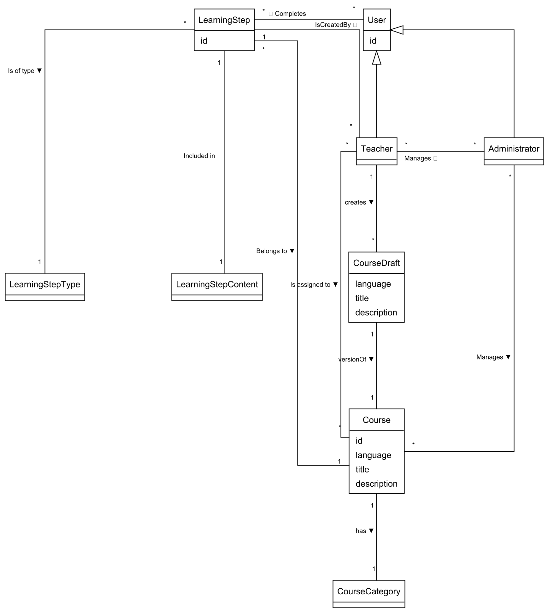

# Actors

- Learners - can learn from courses
- Teachers - can create course content
- Administrators - assign teachers to courses and approve course drafts, manage users

# User Stories

1. As a Learner, I want to be able to see my progress in a course so that I can track my learning journey.
 
2. As a Teacher I want to be able to create a course description, so that I can share my knowledge

3. As an Administrator, I want to be able to manage drafts, so that I can review, approve, or disapprove new drafts, ensuring that only approved drafts are made available for teachers to fill with course data.

4. As a Teacher I want to be able to create Learning Steps for the courses, so that the course has relevant steps which makes tracking progress easier

# Use Case Descriptions

2. 
| **Use Case** | **Submit Course Description for Approval** |
|---------------|---------------------------------------------|
| **Summary** | A Teacher submits a course description for a new course. The Administrator reviews it and either approves it for content creation or disapproves it with feedback. |
| **Actor** | Teacher, Administrator |
| **Precondition** | The Teacher has a valid account and is logged into the system. |
| **Postcondition** | Scenario A: The course description is approved and marked as ready for content creation. Scenario B: The course description is disapproved and the Teacher receives feedback. |
| **Base Sequence** | 1. The Teacher logs into the system. 2. The system authenticates the Teacher. [ALT1] 3. The Teacher navigates to “Propose New Course.” 4. The system displays required course details and prerequisites. 5. The Teacher fills in and submits the course description. 6. The system stores the submission and notifies the Administrator for review. 7. The Administrator reviews the course description. 8. The Administrator approves the course description. 9. The system marks the course as *Approved* and notifies the Teacher. |
| **Alternate Sequence** | [*ALT0] The process can be cancelled at any time. [ALT1] If login credentials are invalid, access is denied and the Teacher is prompted to retry (Go to step 1). [ALT2] **Administrator Disapproves Course Description:**  7a. The Administrator disapproves the course description.  7b. The Administrator provides feedback explaining the reason for disapproval.  7c. The system updates the course status to *Rejected* and sends feedback to the Teacher.  7d. The Teacher may revise and submit a new course description later. |
| **Note** | This use case covers requirement for User Story #2 |

3. 
| **Use Case** | **Manage Draft** |
|---------------|------------------|
| **Summary** | Administrator reviews and then approves or disapproves new drafts so that only approved drafts are made available for teachers to fill with course data. |
| **Actor** | Administrator |
| **Precondition** | There are draft courses awaiting administrative review. |
| **Postcondition** | Scenario A: Approved drafts are marked as ready for teachers to populate with course data. Scenario B: Disapproved drafts are marked as rejected. |
| **Base Sequence** | 1. The Administrator logs into the system. 2. The system authenticates the Administrator. [ALT1] 3. The Administrator requests a list of drafts awaiting review. 4. The system displays the list of pending drafts. 5. The Administrator selects a draft to review. 6. The system displays information about the selected draft. 7. The Administrator approves the draft. [ALT2] 8. The system updates the draft’s status accordingly and confirms the action. |
| **Alternate Sequence** | [*ALT0] The process can be cancelled in all steps if a user desires to. Use case ends. [ALT1] If login credentials are invalid, access is denied and the Administrator is prompted to retry (Go to step 1). [ALT2] Administrator disapproves the draft. |
| **Note** | This use case covers requirement [TODO]. |

\newpage

# Use Case Diagram

\newpage

# Domain Model

# FAA (Frequently Answered Answers)

Administrators and Teachers can also learn on the platform (they don't need to have separate accounts for that).

Teachers can create courses but they need to be approved by an Administrator before they are visible to Learners.

Teachers can edit any course they are assigned to. They are automatically assigned to any course they create.

Learners can not create or edit courses.