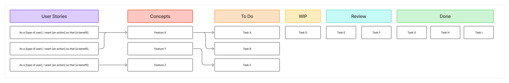

# Purpose

The project guidelines outline the standards and best practices for contributing to and maintaining the project. They ensure consistency, quality, and collaboration among all team members. The main purpose is to align everyone on the same page regarding coding standards, documentation, version control, and communication methods.

# Scope

These guidelines apply to all work related to the project, including but not limited to code contributions, documentation updates, communication methods, and project management practices. They are intended for all team members, and potentially other stakeholders involved in the project.

# Process Definition

**Kanban / Task Board**: A space where each task has one of the predefined states. The states dictate what should happen to the given task.

**Task**: A single unit of work that needs to be completed.

**Task States**:

- **To Do**: Tasks that are planned but not yet started.

- **In Progress**: Tasks that are currently being worked on.

- **In Review**: Tasks that have been completed and are awaiting review or approval. 

- **Done**: Tasks that have been completed and approved. 

**User Story**: A description of a feature from an end-user perspective, typically following the format: "As a [type of user], I want [an action] so that [a benefit]."

**Backlog**: A prioritized list of tasks with the To Do state.

**Concepts**: A collection of abstracted task ideas that can be broken down into proper tasks later.

**Iteration**: A time-boxed period with an agreed state of the project to be achieved by the end of that period.

## Task Lifecycle

The process is driven by user stories. The user stories are either broken down into tasks directly or first collected as concepts and later broken down into tasks. The tasks are then prioritized in the backlog.

The tasks are owner-less by default. Iteration planning and other meetings can be used to assign ownership or responsibility for tasks.

## Roles

- **Product Owner**: Responsible for defining the project vision, managing the backlog, and communicating everything with the Development Team.
- **Development Team**: Everyone involved in the development process.

## Testing and Refactoring

Not all code has to have a 100% unit test coverage. However, a functionality can't just be assumed without proper testing and should be verified via the reviewing processes. 

The main purpose for utilizing automated testing is to promote change and refactoring. If proper tests are in place, the code can be refactored and improved without the fear of breaking existing functionality.

Refactoring or increasing the test coverage can be done outside of the main feature development process, and should not be bound by bureaucratic processes to decrease the friction of improving the codebase.

## Reviewing

All tasks should be reviewed. If not necessary, the whole development team does not have to be involved in a review. The reviewer should either apply their own knowledge and expertise or consult with another party to ensure the quality of the work being reviewed.

# Version Control

The project uses Git for version control. All features and bug fixes should be developed in separate branches, which are then merged into the main branch. The main branch can be considered always deployable.

For simplicity, the branches can either rebase from main before merging or use merge commits. Squashing commits is only encouraged when the feature development has many trivial commits that do not add value to the project history. 

The process of merging should be primarily done by the person reviewing as the main branch should only consist of reviewed and approved code. It is not the reviewer's responsibility to resolve the merge conflicts if any arise but minor conflicts should be resolved by the reviewer when possible to speed up the process.

For commit messages, guidelines such as Commit Principles (Fekete, 2025) can be followed.

# Responsibility and Ownership

When someone bears the responsibility of a task, it means they are accountable for its completion. 

Ownership automatically implies responsibility, but not vice versa. A person can be responsible for the completion of a task without being responsible for the actual implementation if it was delegated to someone else.

Ownership can't be delegated, so the owner of code can not blame the tools or sources they used if something goes wrong. The owner is always ultimately responsible for the code they own. Ownership stems from implementing, creating, or updating something within the project context.

# Code Standards

The project follows established coding standards to ensure consistency and readability across the codebase. All team members are expected to adhere to these standards when contributing code.

The standards are:

- DRY (Don't Repeat Yourself): Avoid code duplication by abstracting common functionality into reusable components or functions.

- KISS (Keep It Simple, Stupid): Strive for simplicity in design and implementation. Avoid unnecessary complexity.

- YAGNI (You Aren't Gonna Need It): Do not implement functionality until it is necessary. Avoid over-engineering.

- SOLID Principles: Follow the SOLID principles of object-oriented design to create maintainable and scalable code.

- Language / Framework Specific Standards: Adhere to the coding conventions and best practices specific to the programming languages and frameworks used in the project. Refer to the documentation for each language/framework for detailed guidelines.