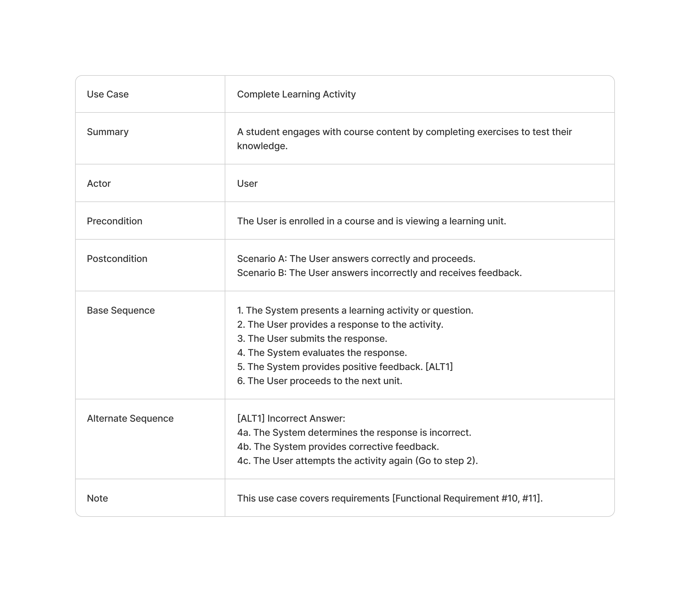
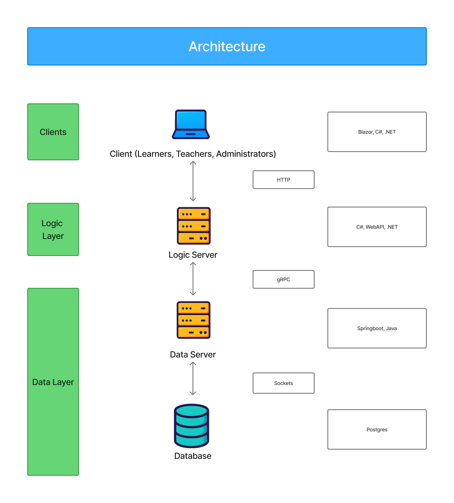
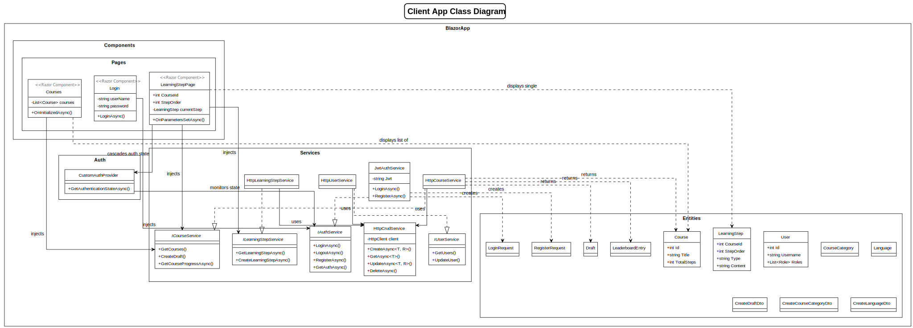
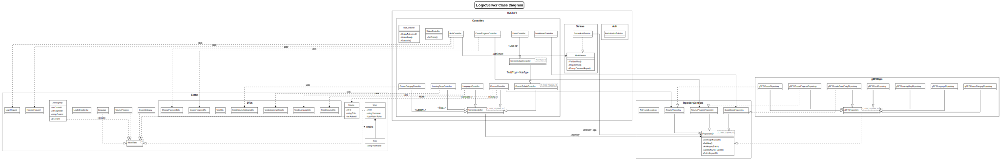
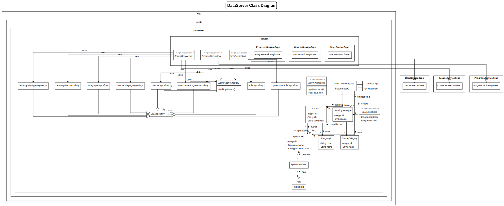
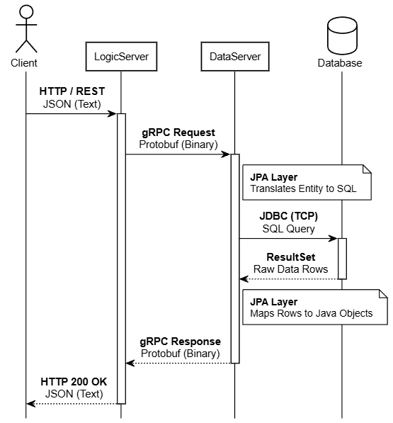
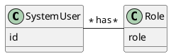
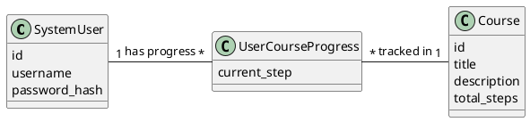
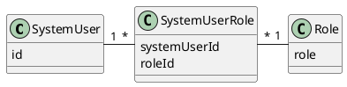
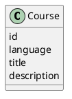

# Abstract

This work focuses on the need for scalable and adaptable digital educational solutions by developing the Learnify system, a distributed software solution with the objective of ensuring seamless content delivery and user assessment. The primary goal is to make a durable multi-server solution that leverages the power of multiple programming languages for enhanced availability, data integrity, and optimized user response. This system was built with a polyglot microservices architecture, using programming languages such as Java and C# to ensure a strict interoperability implementation. Some of the key technical design choices are the use of gRPC for high-speed intra-service communication and HTTP for external client services, ensuring both speed and accessibility. Data storage is achieved using a PostgreSQL database, ensuring that security is taken into account using JWT authentication to overcome the potential dangers of distributed systems. This application development occurred using an iterative approach, centering around User Stories developed both using specialized analysis and interviews with the stakeholders. A functional prototype that can manage multiple user sessions concurrently in a distributed manner was developed. This prototype was verified to meet essential non-functional requirements, confirming the successful interoperability of components across Java and C#. Security compliance was established through the validation of salted password hashing algorithms using Argon2, ensuring robust data protection alongside reliable persistence in the PostgreSQL database. Moreover, the interface was validated for conformance with recognized accessibility guidelines to support complete usability by those with color vision defects. Finally, the project achieved a fully deployable distributed system, validating that the architecture provides a secure, stable, and operational foundation for scalability in the future of education.

\newpage

# Introduction

Acquiring new knowledge is essential part of human life and evolution. Living in the population equals communicating within it and that requires some minimum level of knowledge (UNESCO, 2000). The idea of mandatory education keeps its origin between late 1900s and early 2000s(Habermas, 1984), nonetheless around 40% of the global population still does not have access to proper education in a language they understand (PTI, 2025).

The aim of this project is on the ability to create a system which would be able to provide learning opportunities with main focus on simplifying the accessibility and exploring the idea of learning processes and its speed and efficiency. The goal is to also ensure security, knowledge correctness and deployment of the system.

With the pursuit of knowledge having been a cornerstone of human development for thousands of years, the incorporation of digital technologies into education is in perpetual evolution (Siemens, 2005). A widely accepted model for learning with digital technologies has not been identified, mainly because exponential increases in computing power and volumes of online information constantly redefine how users approach knowledge acquisition, processing, and retention (Haleem et al., 2022).

The approach of this project is to develop a distributed system implemented using at least 2 different programming languages, utilizing a database for data persistence, and adapting a hybrid communication strategy that includes technologies such as gRPC and HTTP.

\newpage

# Main Section

The main section of this document is organized in the direction from the high-level analysis of the problem towards the specific implementation, testing and other relevant aspects of the solution created. This direction does not represent the chronological order of the project development and thus some aspects of the problem might not have a solution designed, implemented, tested, or deployed yet.

This overview represents merely a snapshot of the project development across each phase, and thus does not present a full solution or even analysis of the problem domain.

## Analysis

The fundamental domain knowledge was at first derived from the analyzed problem domain via literature review, and research. Because of the data-driven nature of this project, the analysis focused on stakeholder interactions since the beginning to ensure proper understanding and to test the assumptions made. With more progress made on the solution, the analysis was evolutionary refined to reflect the new understanding of the problem domain in the specificities of the solution space created by Learnify.

The most abstract and crucial aspect of the analysis was defining the system actors. The actors were defined to be:

- Learners
- Teachers
- Admins

The most questionable aspect of the definition was the relationship between the roles, and particularly how teachers and admins relate to it. It was established that teachers and admins are a type of a learner, and this was confirmed throughout the project most importantly because:

- both teachers and admins were expected to be skilled users of the platform (Appendix 10.1, Interview_261125.pdf) and were supposed to be educated on it (Appendix 10.1, Interview_121025.pdf)
- both teachers and admins were understood as learners within the leaderboard setting and were expected to be equal participants in it (Appendix 10.1, Interview_121025.pdf)

### Actor Descriptions

#### Learner

Learners strive for knowledge acquisition. They want to be motivated to learn and they should be allowed to have a structured way of learning new information. They want to be able to learn various different topics at their own pace. They are looking for a gamified experience.

#### Teacher

Teachers are trusted Learners, who also want to share their knowledge with others. They want to be able to manage courses easily and have a structured way of doing it.

#### Administrator (Admin)

Admins are trusted Learners, who have the right to manage the platform. They should be able to manage all learners, and platform settings.

### Requirements

#### Functional requirements

The functional requirements are structured as user stories to better capture the perspective of the actor and to clarify permissions and intentions behind each requirement. This way the user stories served as the fundamental source of truth and a guide light for understanding the problem and being able to design a solution that would address the problem preserving the idea behind the intention of the actor.

|  ID   | User Story                                                                                                                |
| :---: | :------------------------------------------------------------------------------------------------------------------------ |
| USL1  | As a Learner, I want to register for an account so that I can access the platform.                                        |
| USL2  | As a Learner, I want to log in so that I can access the platform from my account.                                         |
| USL3  | As a Learner, I want to see in which courses I am enrolled in, so that I can continue where I left off.                   |
| USL4  | As a Learner, I want to continue learning where I left off, so that I don't have to start over every time.                |
| USL5  | As a Learner, I want to see all available courses, so that I can explore and choose what I want to learn.                 |
| USL6  | As a Learner, I want to filter courses, so that I can find specific content quickly.                                      |
| USL7  | As a Learner, I want to unenroll from a course, so that I can stop learning a course I no longer want to finish.          |
| USL8  | As a Learner, I want to view the Leaderboard, so that I can compare my progress with other learners.                      |
| USL9  | As a Learner, I want to view my Profile, so that I can see my personal account details.                                   |
| USL10 | As a Learner, I want to test my knowledge within the course, so that I know I understood the topic and I am not bored.    |
| UST1  | As a Teacher, I want to submit a course draft, so that I can find out if my course idea is relevant for the platform.     |
| UST2  | As a Teacher, I want to manage course content, so that I can correct or improve previous work.                            |
| UST3  | As a Teacher, I want to edit course information, so that I can correct mistakes.                                          |
| USA1  | As an Admin, I want to see all drafts, so that I know what drafts are waiting for approval.                               |
| USA2  | As an Admin, I want to approve course drafts, so that the teacher knows they can work on such course.                     |
| USA3  | As an Admin, I want to add course categories and languages, so that the platform can easily adapt to new content.         |
| USA4  | As an Admin, I want to manage users’ roles, so that I can manage what access is given to the platform and to what degree. |
| USA5  | As an Admin, I want to disapprove course drafts, so that the teacher knows such course is not needed at the moment.       |

*Table 1: Functional Requirements (Appendix 2.1 Requirements)*

The user stories are sorted based on the actors to which they correspond, not according to the chronological order in which they were added/discovered. The chronological order is also not perfectly reflected on the IDs, as these were not always static for the same user story (when managing them, they would be adjusted)

#### Non-functional requirements

1. The system must be polyglot
2. User passwords must be securely stored at rest
3. The system must be deployable
4. The system must be color-blind friendly

### Use cases and their related requirements

In order to address the user stories, use cases of the system were developed, which further clarified the requirements and provided a basis for understanding the system behaviour (giving basis for dynamic rather than static analysis).

The uses cases developed are shown in a table below:

| ID   | Use Case                   |
| :--- | :------------------------- |
| UC1  | Register                   |
| UC2  | Log in                     |
| UC3  | Manage Personal Learning   |
| UC4  | Browse and Search Catalog  |
| UC5  | Complete Learning Activity |
| UC6  | View User Profile          |
| UC7  | View Leaderboard           |
| UC8  | Create Course Draft        |
| UC9  | Edit Course Content        |
| UC10 | Manage System Settings     |
| UC11 | Review Course Drafts       |
| UC12 | Manage User Roles          |

*Table 2: Use Cases (Appendix 2.2 Use Cases)*


The table below shows how the use cases are related to the user stories

| User Story | Use Cases Addressing It |
| :--------- | :---------------------- |
| USL1       | UC1                     |
| USL2       | UC2                     |
| USL3       | UC3                     |
| USL4       | UC3, UC5                |
| USL5       | UC4                     |
| USL6       | UC4                     |
| USL7       | UC3                     |
| USL8       | UC7                     |
| USL9       | UC6                     |
| USL10      | UC5                     |
| UST1       | UC8                     |
| UST2       | UC9                     |
| UST3       | UC9                     |
| USA1       | UC11                    |
| USA2       | UC11                    |
| USA3       | UC10                    |
| USA4       | UC12                    |
| USA5       | UC11                    |

*Table 3: Use Cases and their related requirements (Appendix 2.2 Use Cases)*


### Use case diagram (UCD)

To depict how the use cases were related to the system actors, a use case diagram was created as shown below:

{width=60%}

As can be seen, the UCD also introduced the internal boundary for teachers and admins - specifying that these actors are not simply learners with privileges but there is a boundary to be crossed when becoming a teacher or an admin. The UCD also specifies the system boundary, which in the case of Learnify covers all the use cases developed.

### Use case descriptions

In order to fully describe the use cases, use case descriptions were created; an example below shows such use case description, specifically for the UC5 - Complete Learning Activity use case:



As seen above, the use case descriptions provided a structured way of understanding how the system should behave and gave a strong basis for the test cases. 

All the use case descriptions were made in the same format with:

- Use Case ID and Name
- Summary
- Actor(s)
- Preconditions
- Postconditions
- Base Sequence
- Alternative Sequences

### System sequence diagrams (SSD)

System Sequence Diagrams (SSDs) were developed to illustrate the interaction between the system actors and the system as a black box. By focusing on the input and output events, the SSDs helped in identifying the necessary system operations and the data that needs to be exchanged to fulfill each use case.

An SSD was created for each of the 12 use cases, ensuring that the dynamic behavior of the system is fully captured from an external perspective.

The figure below shows the SSD for UC5 - Complete Learning Activity, which highlights the iterative nature of the learning process and the system's role in providing feedback.

{width=60%}

### Activity diagrams

The development of activity diagrams was crucial in understanding the dynamic behaviour and the interplay of several use cases and domain entities. While use case descriptions provide a structured textual representation, activity diagrams allow for a visual understanding of the logical flow, decision points, and the interaction between the user and the system's core components.

A set of activity diagrams was developed to cover the most critical workflows of the Learnify platform, including user onboarding, course discovery, content creation, and the learning process itself. 

The activity diagram below illustrates the core workflow of a Learner interacting with the platform. It demonstrates the interplay between UC3 (Manage Personal Learning), UC5 (Complete Learning Activity), and UC7 (View Leaderboard). 


This diagram is arguably one of the most important aspects of the application as it demonstrates something similar to a core loop of the system - a typical path a user takes within a session.

By modeling these workflows, the analysis phase ensured that the system's dynamic behavior aligns with the identified user stories and the relationships defined in the domain model.

### Test Cases

Following the definition of the system’s dynamic behavior through use cases, SSDs and activity diagrams, a set of high-level test cases was derived to formalize the acceptance criteria for the Learnify system. These test cases were constructed directly from the use case descriptions, specifically targeting the preconditions, base sequences, and alternative sequences defined in the previous sections.

The objective of defining these test cases during the analysis phase - rather than the testing phase - was to ensure understanding of system's functionality and to aid the definition of done.

| Test Case ID | Test Case Name | Description | Precondition | Steps | Expected Result |
| :--: | :---- | :--- | :-- | :----------- | :------ |
| TC_UC_01a | Register User - Success | Verify a new user can register with valid data. | User does not have an account. | 1. User initiates registration.<br>2. System requests details.<br>3. User submits valid data.<br>4. System validates input.<br>5. System creates account.<br>6. System confirms registration. | Account created; user prompted to login. |
| TC_UC_01b | Register User - Invalid/Duplicate | Verify registration fails with invalid or existing data. | User provides existing username. | 1. User initiates registration.<br>2. User submits invalid/existing data.<br>3. System detects error.<br>4. System displays error message. | Registration rejected; user prompted to correct data. |
| TC_UC_02a | Log In - Success | Verify registered user can log in with valid credentials. | User has a registered account. | 1. User initiates login.<br>2. User enters valid credentials.<br>3. System authenticates.<br>4. System creates session.<br>5. System grants access. | User is redirected to dashboard. |
| TC_UC_02b | Log In - Failure | Verify login is rejected with invalid credentials. | User is logged out. | 1. User initiates login.<br>2. User enters wrong credentials.<br>3. System rejects authentication.<br>4. System displays error. | Access denied; user remains on login page. |
| TC_UC_03a | Manage Learning - Resume | Verify learner can resume a course. | Learner is enrolled in a course. | 1. Learner opens enrolled courses.<br>2. Learner selects course to continue.<br>3. System restores last saved progress. | Course opens at the exact point where the user left off. |
| TC_UC_03b | Manage Learning - Unenroll | Verify learner can unenroll from a course. | Learner is enrolled in a course. | 1. Learner selects unenroll option.<br>2. System removes course from learner list. | Course is no longer visible in user's active enrollments. |
| TC_UC_04a | Search Catalog - Results | Verify search returns matching courses. | User is logged in. | 1. User opens catalog.<br>2. User enters search term that matches content.<br>3. System filters results. | System displays relevant courses matching the term/filters. |
| TC_UC_04b | Search Catalog - No Results | Verify system behavior when no matches are found. | User is logged in. | 1. User opens catalog.<br>2. User enters search term with no matches.<br>3. System processes search. | System displays that no course was found with such filters. |
| TC_UC_05a | Learning Step - Correct Answer | Verify handling of correct answers. | User is viewing a learning step. | 1. System displays the step.<br>2. User submits correct response.<br>3. System gives positive feedback.<br>4. User proceeds to next unit. | Progress is updated; next unit is unlocked. |
| TC_UC_05b | Learning Step - Incorrect Answer | Verify handling of incorrect answers. | User is viewing a learning step. | 1. System displays the step.<br>2. User submits incorrect response.<br>3. System provides corrective feedback.<br>4. User retries activity. | User cannot proceed until correct answer is provided. |
| TC_UC_06 | View User Profile | Verify profile display accuracy. | User is logged in. | 1. User accesses account info.<br>2. System displays profile details. | The user details match the database. |
| TC_UC_07 | View Leaderboard | Verify leaderboard ranking display. | User is logged in. | 1. User opens leaderboard.<br>2. System calculates and displays rankings. | Global rankings are visible and accurate. |
| TC_UC_08 | Create Course Draft | Verify teacher can create a new draft. | Teacher is logged in. | 1. Teacher enters details.<br>2. Teacher submits draft.<br>3. System saves draft. | Draft is stored and visible in teacher's workspace. |
| TC_UC_09 | Edit Course Content | Verify teacher can modify existing content. | Course exists (and has the teacher as admin). | 1. Teacher enters the course edit mode.<br>2. Teacher modifies the learning step.<br>3. Teacher saves changes. | System updates content and confirms save. |
| TC_UC_10a | Admin - Manage Categories | Verify admin can create categories. | Admin is logged in. | 1. Admin goes into management part.<br>2. Admin creates new category.<br>3. System saves category. | Category becomes available for course tagging (setting/changing the category). |
| TC_UC_10b | Admin - Manage Languages | Verify admin can create languages. | Admin is logged in. | 1. Admin goes into management part.<br>2. Admin creates new language.<br>3. System saves language. | Language becomes available for course tagging (setting/changing the language). |
| TC_UC_11a | Admin - Approve Draft | Verify draft. | Draft exists in pending queue. | 1. Admin reviews draft.<br>2. Admin approves.<br>3. System creates the course. | Course becomes available to work on. |
| TC_UC_11b | Admin - Disapprove Draft | Verify draft rejection. | Draft exists in pending queue. | 1. Admin reviews draft.<br>2. Admin disapproves.<br>3. System deletes the draft. | Course is not created and draft is removed. |
| TC_UC_12a | Admin - Assign Role | Verify role assignment. | Target user exists. | 1. Admin selects user in the management part.<br>2. Admin assigns a role the user does not have. | User's permissions are immediately elevated. |
| TC_UC_12b | Admin - Remove Role | Verify role revocation. | Target user has a specific role. | 1. Admin selects user.<br>2. Admin removes existing role. | User's permissions lack the one's that came from the removed role. |

*Table 4: Test Cases (Appendix 2.4 Tests)*

### Domain model

The domain model was constructed for this project to better understand the problem domain and to aid communication among stakeholders. The crucial aspect of developing the domain model was identifying the relationships between different kinds of users, in particular the roles and responsibilities of Learners, Teachers, and Administrators; which had to be combined with the security aspect of the system as well as had to align with the shared understanding of the stakeholders.

{width=80%}

The figure above shows the domain model for Learnify. It can be seen that the crucial aspect of fully describing the different system roles is understanding what entities exist and how they relate to each other.

The inheritance from the User entity reflects the fact that all system users have some common basic attributes, rights and behaviours that can be generalized.

The philosophy behind the attribute selection and abstraction into separate entities was to provide full flexibility for future development of the system, and ensuring that no restrictions are imposed for no reason. For example, Learning Steps are abstracted into three different entities to fully support any kind of idea of a learning step as seen both in the domain and from stakeholder interactions.

At the same time, the domain model was kept in its simplest form possible in terms of more abstract entity concepts. As can be seen on the domain model, the core aspects of the system are:

- Users
- Courses
- Learning Steps

And it could be further argued that Learning Steps only exist as a part of Courses, therefore the Domain Model is centered around the idea of Users learning from Courses, which did not change from the initial vision of the system.

The inclusion of stakeholders as entities within the domain model mostly arised from the need of defining and understanding attributes and relationships of Users.

### Security Requirements

The security requirements for the system were developed as a part of the threat modelling process. The security objectives were as follows:

- **Confidentiality:** Protect user passwords and personal data from unauthorized disclosure.
- **Integrity:** Ensuring that data can not be altered or tampered with by unauthorized parties.
- **Availability:** Ensure the system remains accessible during high traffic or denial-of-service attempts.
- **Accountability:** Actions must be uniquely traceable to a specific entity.
- **Authenticity:** Verify that data inputs and users are genuine.

These objectives were developed based on the CIA triad and expanded to fit the needs of the system (Appendix 7.1 Threat Model).

Similarly to other parts of the analysis phase, stakeholder interactions shaped the system's security requirements. In particular, even testing the prototype (before having the core system functional) showed concerns about the authority of Administrators and Teachers, and needs for accountability for actions.

## Design

### System design

The aim of the designing phase was to establish a clear vision and guide for implementing the solution. Design phase created the largest gap between the initial problem definition and the approach taken to solve it by transforming certain concepts into an implementable or more flexible form (e.g. user roles).

#### Wireframes

Wireframes were used along other rough sketches to design the components of the user interface without the hassle of dealing with the final styling. Because of the chosen methodologies, wireframes provided a strong basis for creating HTML skeletons of various razor pages.

{width=80%}

The figure above depicts one of the wireframes created for the system - all courses page or as described in the analysis - "The Course Catalogue".

The interface also includes features which are showed only to users with specific roles (Teacher, Admin); it can be seen that there are two action buttons named "Create Draft" which appears only for users with a Teacher role and "Waiting Drafts" which appears only for users who are an Administrator. These buttons give Teachers and Administrators quick access to content creation and moderation tool while keeping the learner view free from unnecessary elements.

The fidelity of the wireframes was kept low but the transformation into the chosen technology PlantUML (TODO: Source puml web) provided a more visually accurate representation with less details provided from the creation inputs; ultimately resulting in wireframes that appear of higher fidelity.

### Architectural overview

The architectural overview shown on the figure below presents how the three-tier architecture of the system was looks like including all servers and how they communicate between them. Starting with client layer, which is responsible for running a server in C# Blazor .NET, it can be seen that its job is to host a web application which can be accessible by three types of users (Learners, Teachers and Administrators). Client application communicates with Logic Server, located inside the logic layer, by using HTTP requests and responses. Then from the Logic server information is being sent further into the data server, located inside data tier, which happens by following the gRPC protocol, which is faster than HTTP due to different formatting. Logic server was implemented using C# and Data server using Java. At the end of the architecture chain we have the Postgres database. The data is received through sockets.
Although the three-tier overview seems to appear a bit basic, each tier plays their own important role in the system, ensuring that for example data server is not responsible for any feature logic but only performs operations between the database.

{width=60%}

### Communication Protocol Design:
We decided to make a class diagram for each of the servers, demonstrating their independence. These are the Client App, Logic Server and Data Server.

#### Client App Class Diagram

This server is responsible for displaying the system to the client and to help the client navigate through our system, giving freedom to the user to use the system as they please, using high-level methods.



#### Logic Server Class Diagram

In this server the logic of the system is defined through the controllers, allowing the client server to perform the actions requested by the client.



#### Data Server Class Diagram

This server main responsibility is to manage the database by adding, fetching, modifying and deleting the entities, ensuring that the logic server requests are completed successfully.



### Communication protocol design

The system implements a multi-tiered architecture that utilizes distinct communication protocols for external and internal interactions. The sequence diagram in Figure X illustrates the end-to-end communication flow, demonstrating how the Client, Logic Server, and Data Server interact to process a request.

{width=60%}

#### Interface Definition (gRPC & Protobuf)

Internal communication between the Logic Server and the Data Server is managed via gRPC. The data structures and service contracts are defined using Protocol Buffers (Protobuf), ensuring strict typing.

The next code snippet demonstrates the definition of the message structures (Requests and Responses) used within the system.

```Protobuf
message User {
  int32 id = 1;
  string username = 2;
  string password = 3;
  repeated Role roles = 4;
}

message Role {
  string role = 1;
}

message GetUsersRequest {}

message GetUsersResponse {
  repeated User users = 1;
}
```

The next code snippet illustrates the service definition, detailing the RPC methods, their required parameters, and return types.

```Protobuf
service UserService {
  rpc GetUsers(GetUsersRequest) returns (GetUsersResponse);
  rpc GetUser(GetUserRequest) returns (User);
  rpc AddUser(AddUserRequest) returns (AddUserResponse);
  rpc UpdateUser(UpdateUserRequest) returns (User);
}
```

#### API Specification

The Logic Server exposes a RESTful API to external clients using standard HTTP/1.1 protocols. This design streamlines client integration by using standard HTTP verbs (GET, POST, PUT, DELETE) and status codes.

For example, authentication is handled via the /auth/login endpoint. By sending a POST request to http://localhost:9090/auth/login with the correct credentials, a client can successfully authenticate and connect to the system.

#### Protocol Justification

A hybrid protocol approach was chosen to balance user experience with system performance, in specific, we chose to use HTTP for the logic server and gRPC for the data server:

· External Communication (HTTP/JSON): We utilized HTTP with JSON for client-server interaction because of its universality and readability. JSON is natively supported by web browsers and mobile clients, making the system easy to debug and integrate. While the text-based format introduces some overhead, the trade-off favors the ease of development and broad compatibility required at the client layer.

· Internal Communication (gRPC/Protobuf): For communication between the Logic and Data servers, gRPC was selected over REST. Unlike the text-based JSON, gRPC uses Protocol Buffers to serialize data into a binary format. This results in significantly smaller payload sizes and faster serialization/deserialization times. Furthermore, gRPC operates over HTTP/2, allowing for multiplexing and lower latency, which is critical for high-throughput internal traffic.

### Database design

#### Enhanced Entity Relationship Diagram

As means of bridging the gap from the problem domain in general and the Learnify system in specific, an EER diagram was created as can be seen on the figure below:


The EER developed does not significantly differ from the domain model as both diagrams are conceptual and could in theory be used interchangeably. However, the EER diagram further reflects the decisions made during analysis, which most notably reflected on the way how roles are handled.



The figure above is a part of the domain model (Appendix 2.3 Diagrams) and focuses on the relationship between the User and their Roles. This relationship in contrast to inheritance based models provides a flexible and strict way of handling user roles - their permissions and access to the system. Most importantly it does not hide the complexities of inheritance into a seemingly simple abstraction and prevents the potential issues that could arise from mindless inheritance hierarchies.

Certain relationships could in theory be kept as many-to-many, however the need to attach attributes to these relationships led to the preference of a separate entity to hold the attribute thus separating the concerns and providing a more flexible design. This can be seen on, for example, the UserCourseProgress entity as shown below:



#### Relational Schema

Contrary to the conceptual modelling, the logical modelling required adherence to the rules and specificities of the relational model.
Because of the designed use of standard relational database (PostgreSQL), the mapping of the EER needed to determine all the necessary resolutions of relationships, strong and weak entities, and the establishment of integrity keys.

The mapping of the EER diagram resulted in a relational schema and the to it related global relations diagram.

The mapping resulted in the relation schema as shown on the figure below:


As can be seen below on the part of Global Relational Diagram (Appendix 2.3 Diagrams), the many-to-many relationships got resolved into new relations - SystemUserRole, and UserCourseProgress.



#### Global Relations Diagram (GR/GRD)

Relational schema and Global Relations Diagram are technically identical. In the project Learnify, the GRD was the main source of truth for later implementation of the database structure and discussing the data persistence design.

The final GR diagram is shown on the figure below:


It can be seen that the GRD reflects the same concepts as the relational schema, however, in this case the positioning of the elements provides a more natural step going from the EER and the domain model; although, the positioning did not fully preserve the conceptual relationships as seen in the EER diagram.

### Class diagram design

We decided to make a class diagram for each of the servers, demonstrating their independence. These are the Client App, Logic Server and Data Server.

#### Client App Class Diagram

This server is responsible for displaying the system to the client and to help the client navigate through our system, giving freedom to the user to use the system as they please, using high-level methods.


#### Logic Server Class Diagram

In this server the logic of the system is defined through the controllers, allowing the client server to perform the actions requested by the client.


#### Data Server Class Diagram

This server main responsibility is to manage the database by adding, fetching, modifying and deleting the entities, ensuring that the logic server requests are completed successfully.


### Communication protocol design

The system implements a multi-tiered architecture that utilizes distinct communication protocols for external and internal interactions. The sequence diagram in Figure X illustrates the end-to-end communication flow, demonstrating how the Client, Logic Server, and Data Server interact to process a request.


#### Interface Definition (gRPC & Protobuf)

Internal communication between the Logic Server and the Data Server is managed via gRPC. The data structures and service contracts are defined using Protocol Buffers (Protobuf), ensuring strict typing.

The next code snippet demonstrates the definition of the message structures (Requests and Responses) used within the system.

```Protobuf
message User {
  int32 id = 1;
  string username = 2;
  string password = 3;
  repeated Role roles = 4;
}

message Role {
  string role = 1;
}

message GetUsersRequest {}

message GetUsersResponse {
  repeated User users = 1;
}
```

The next code snippet illustrates the service definition, detailing the RPC methods, their required parameters, and return types.

```Protobuf
service UserService {
  rpc GetUsers(GetUsersRequest) returns (GetUsersResponse);
  rpc GetUser(GetUserRequest) returns (User);
  rpc AddUser(AddUserRequest) returns (AddUserResponse);
  rpc UpdateUser(UpdateUserRequest) returns (User);
}
```


#### API Specification

The Logic Server exposes a RESTful API to external clients using standard HTTP/1.1 protocols. This design streamlines client integration by using standard HTTP verbs (GET, POST, PUT, DELETE) and status codes.

For example, authentication is handled via the /auth/login endpoint. By sending a POST request to http://localhost:9090/auth/login with the correct credentials, a client can successfully authenticate and connect to the system.

#### Protocol Justification

A hybrid protocol approach was chosen to balance user experience with system performance, in specific, we chose to use HTTP for the logic server and gRPC for the data server:

· External Communication (HTTP/JSON): We utilized HTTP with JSON for client-server interaction because of its universality and readability. JSON is natively supported by web browsers and mobile clients, making the system easy to debug and integrate. While the text-based format introduces some overhead, the trade-off favors the ease of development and broad compatibility required at the client layer.

· Internal Communication (gRPC/Protobuf): For communication between the Logic and Data servers, gRPC was selected over REST. Unlike the text-based JSON, gRPC uses Protocol Buffers to serialize data into a binary format. This results in significantly smaller payload sizes and faster serialization/deserialization times. Furthermore, gRPC operates over HTTP/2, allowing for multiplexing and lower latency, which is critical for high-throughput internal traffic.

### Data Persistence Design (maybe we should add some design related to this?):

ER Diagram: showing how data is structured in the database.

Consistency Model: Since it is distributed, mention how you handle data integrity across services.

## Implementation

The implementation of the system followed the designed architecture and communication protocols with a focus on setting up the core of the architecture first as one continuous vertical slice.

At first, a database schema was created in PostgreSQL, a Springboot project was created for the Data Server, and two .NET solutions were created for the Logic Server and the Client Application.

This stage did not include any actual logic but rather provided a skeleton of the system. One of the decisions taken at this stage was to maintain separate solutions for the Logic Server and Client Application. Despite the initial idea of implementing a shared solution, it was decided that the feature of C# anonymous types would suffice for most of the purposes of data transfer objects (DTOs) and that the added complexity of a shared solution would not be justified.

The implementation of the skeleton was followed by a the implementation of a vertical slice which focused on fetching all courses from the database.

The individual components of the vertical slice can be seen below on the part of Domain Model (Appendix 2.3 Diagrams):



At a later stage, the original database setup was split into pure DDL script and a dummy data initial setup crucial for testing stages mentioned later in this document.

### Methods and tools

Going further into implementation details, Java and C# programming languages were chosen to meet the requirements of multilanguage system. For storing information PostgreSQL database has been implemented. 
The development team chose C# Blazor .NET for the frontend because its component-based system gave a possibility for fast GUI development without needing an additional JavaScript code. On the Logic Server, ASP.NET Core provided an intuitive environment for managing REST endpoints and gRPC services, facilitating high-speed communication. It was achieved by using shared Data Transfer Objects (DTOs) and validation logic which kept data model changes synchronized between client and server systems. 
Java programming language was selected to run the Data Server because it met our polyglot requirements and demonstrated how .NET and Java systems can work together using gRPC protocol, which is explained further in the integration logic paragraph below.


### Data Server Implementation:

### Logic Server Implementation: 

### Blazor Client App Implementation:

### Integration Logic:

Show how the two services "talk" to each other. Provide a code snippet showing the gRPC client/server handshake or the HTTP request handling.

### Security Implementation

Learnify bases its entire system security approach on the foundation of its Security Policy (Appendix 7.2 Security Policy). The document describes vital security measures which organizations employ to protect their information from unauthorized access and security breaches. The System depends on three critical security principles which include confidentiality, integrity and availability that protect its core functions through multiple essential security measures. The process needs each user to enter their personal login details for authentication. The policy specifies that users needs to create passwords which contain at least eight characters to safeguard their accounts. Role-Based Access Control (RBAC) provides additional protection through its access management system which grants specific permissions to Learners and Teachers and Administrators based on their designated roles. The Logic Server performs user role verification through generated claims to authorize only permitted actions before processing any requests. The endpoints of WebApi logic server have been secured. The team strived to achieve data security by using a well-planned system which organizes information through classification and protects it with encryption methods. The system contains three types of data which include public information that users can access through registration and login pages, internal information that requires authentication to view course catalogs and content and sensitive information which needs encryption for user passwords. The system uses Argon2 as a secure password hashing function which includes salting to protect user information. The system operates with continuous security measures and regular software updates to maintain its network security. It functions through a firewall which grants access to particular ports that are essential for operation.

## Testing

### Testing Approach

Testing in this project was structured around the V-Model (TODO: Source), where testing activities are planned in parallel with developments phases. Instead of treating testings as a final step, test considerations were introduced early, starting at the requirement analyses, and refined as the system design evolved. This approach ensured that development decision had a corresponding verification strategy.

The first step of the V-Model was requirement analysis, which directly maps to acceptance testing.

At this stage, testing focused on answering a simple but critical question:

How can we tell that the system fulfills the user's requirements?

Rather then writing code-level tests, the team defined high-level acceptance criteria for each use case. These criteria described:

- What user expects to achieve
- Under which conditions the system should allow or deny actions
- What outcome confirms that the requirement is fulfilled

These acceptance-oriented test ideas were later used to validate the system both manually and through automated test. In this way, test cases were already embedded in the analysis phase.

In practice, different types of tests naturally aligned with different parts of the V-Model:

- High-level test cases and use-case validation corresponded to the upper part of the V (requirements and acceptance testing).
- Automated tests focused mainly on the lower part of the V, especially unit and integration testing.

Automated tests focused mainly on the lower part of the V, especially unit and integration testing.

### Tools and frameworks

A combination of automated and manual testing tools was used throughout the project:

- xUnit / JUnit – Used for writing automated unit and integration tests.
- Mockito / Mocking frameworks – Used to isolate logic and mock external dependencies.
- HTTP client–based tests – Used for endpoint-level testing.
- .http files – Used early in development for manual REST endpoint testing.
- BloomRPC – Used for manually testing gRPC endpoints.
- In-memory repositories – Used to test logic without external dependencies.
- IDE tooling (Visual Studio / IntelliJ) – Used for writing, executing, and debugging tests.

### What was tested

Testing focused primarily on core logic and system-critical behavior, rather than attempting full coverage of all UI components.

The following aspects of the system were tested:

- Business logic in the logic server
- REST and gRPC endpoints
- Authentication and authorization behavior
- Role-based access control
- Course and draft management workflows
- Integration between services

The team aimed for high endpoint coverage, testing endpoints under different scenarios such as:

- Different user roles and credentials
- Authorized vs. unauthorized access
- Expected success paths

However, testing of faulty or malformed input data was less comprehensive. While access control and permissions were thoroughly tested, negative scenarios involving invalid data were sometimes under-tested. This limitation is acknowledged as an area for improvement.

### Method-level test case documentation

Method-level testing focused on logic-heavy and high-impact methods, following a white-box testing approach. Instead of testing every method, priority was given to areas where errors would have the greatest impact on system behavior.

For critical methods, tests were designed to cover:

- Normal execution paths
- Boundary conditions
- Exceptional cases
- Interface correctness

This approach ensured that the internal behavior of key methods was thoroughly validated, not just their external outputs. Test cases were documented to show clear intent and traceability between requirements, logic, and expected outcomes.

| Test Case ID | Test Case Name | Description | Precondition | Steps | Expected Result | Actual Result |
| :--: | :---- | :--- | :-- | :----------- | :------ | :---- |
| TC_UC_01a | Register User - Success | Verify a new user can register with valid data. | User does not have an account. | 1. User initiates registration.<br>2. System requests details.<br>3. User submits valid data.<br>4. System validates input.<br>5. System creates account.<br>6. System confirms registration. | Account created; user prompted to login. | not performed |
| TC_UC_01b | Register User - Invalid/Duplicate | Verify registration fails with invalid or existing data. | User provides existing username. | 1. User initiates registration.<br>2. User submits invalid/existing data.<br>3. System detects error.<br>4. System displays error message. | Registration rejected; user prompted to correct data. | not performed |
| TC_UC_02a | Log In - Success | Verify registered user can log in with valid credentials. | User has a registered account. | 1. User initiates login.<br>2. User enters valid credentials.<br>3. System authenticates.<br>4. System creates session.<br>5. System grants access. | User is redirected to dashboard. | not performed |
| TC_UC_02b | Log In - Failure | Verify login is rejected with invalid credentials. | User is logged out. | 1. User initiates login.<br>2. User enters wrong credentials.<br>3. System rejects authentication.<br>4. System displays error. | Access denied; user remains on login page. | not performed |
| TC_UC_03a | Manage Learning - Resume | Verify learner can resume a course. | Learner is enrolled in a course. | 1. Learner opens enrolled courses.<br>2. Learner selects course to continue.<br>3. System restores last saved progress. | Course opens at the exact point where the user left off. | not performed |
| TC_UC_03b | Manage Learning - Unenroll | Verify learner can unenroll from a course. | Learner is enrolled in a course. | 1. Learner selects unenroll option.<br>2. System removes course from learner list. | Course is no longer visible in user's active enrollments. | not performed |
| TC_UC_04a | Search Catalog - Results | Verify search returns matching courses. | User is logged in. | 1. User opens catalog.<br>2. User enters search term that matches content.<br>3. System filters results. | System displays relevant courses matching the term/filters. | not performed |
| TC_UC_04b | Search Catalog - No Results | Verify system behavior when no matches are found. | User is logged in. | 1. User opens catalog.<br>2. User enters search term with no matches.<br>3. System processes search. | System displays that no course was found with such filters. | not performed |
| TC_UC_05a | Learning Step - Correct Answer | Verify handling of correct answers. | User is viewing a learning step. | 1. System displays the step.<br>2. User submits correct response.<br>3. System gives positive feedback.<br>4. User proceeds to next unit. | Progress is updated; next unit is unlocked. | not performed |
| TC_UC_05b | Learning Step - Incorrect Answer | Verify handling of incorrect answers. | User is viewing a learning step. | 1. System displays the step.<br>2. User submits incorrect response.<br>3. System provides corrective feedback.<br>4. User retries activity. | User cannot proceed until correct answer is provided. | not performed |
| TC_UC_06 | View User Profile | Verify profile display accuracy. | User is logged in. | 1. User accesses account info.<br>2. System displays profile details. | The user details match the database. | not performed |
| TC_UC_07 | View Leaderboard | Verify leaderboard ranking display. | User is logged in. | 1. User opens leaderboard.<br>2. System calculates and displays rankings. | Global rankings are visible and accurate. | not performed |
| TC_UC_08 | Create Course Draft | Verify teacher can create a new draft. | Teacher is logged in. | 1. Teacher enters details.<br>2. Teacher submits draft.<br>3. System saves draft. | Draft is stored and visible in teacher's workspace. | not performed |
| TC_UC_09 | Edit Course Content | Verify teacher can modify existing content. | Course exists (and has the teacher as admin). | 1. Teacher enters the course edit mode.<br>2. Teacher modifies the learning step.<br>3. Teacher saves changes. | System updates content and confirms save. | not performed |
| TC_UC_10a | Admin - Manage Categories | Verify admin can create categories. | Admin is logged in. | 1. Admin goes into management part.<br>2. Admin creates new category.<br>3. System saves category. | Category becomes available for course tagging (setting/changing the category). | not performed |
| TC_UC_10b | Admin - Manage Languages | Verify admin can create languages. | Admin is logged in. | 1. Admin goes into management part.<br>2. Admin creates new language.<br>3. System saves language. | Language becomes available for course tagging (setting/changing the language). | not performed |
| TC_UC_11a | Admin - Approve Draft | Verify draft. | Draft exists in pending queue. | 1. Admin reviews draft.<br>2. Admin approves.<br>3. System creates the course. | Course becomes available to work on. | not performed |
| TC_UC_11b | Admin - Disapprove Draft | Verify draft rejection. | Draft exists in pending queue. | 1. Admin reviews draft.<br>2. Admin disapproves.<br>3. System deletes the draft. | Course is not created and draft is removed. | not performed |
| TC_UC_12a | Admin - Assign Role | Verify role assignment. | Target user exists. | 1. Admin selects user in the management part.<br>2. Admin assigns a role the user does not have. | User's permissions are immediately elevated. | not performed |
| TC_UC_12b | Admin - Remove Role | Verify role revocation. | Target user has a specific role. | 1. Admin selects user.<br>2. Admin removes existing role. | User's permissions lack the one's that came from the removed role. | not performed |

*Table 5: Test Cases Results (Appendix 2.4 Tests)*


### Benefits and bug detection

Testing played an important role in maintaining system stability throughout development and gave the team confidence when introducing changes.

One of the main benefits of automated testing was that it enabled safe refactoring. Because core logic and most endpoints were covered by tests, the team could restructure and improve the codebase without the constant risk of breaking existing functionality. This was especially valuable in later stages of the project, where refactoring became more frequent as the system matured.

In several cases, features appeared to work correctly when tested manually through the user interface, but automated tests revealed issues that were not immediately visible. These included:

- Missing validation for null or unexpected input
- Edge cases and boundary values not being handled correctly
- Operations failing silently without clear feedback

The team followed a continuous test–fix–verify cycle during development. When a problem was discovered, it was corrected, committed through version control, and often accompanied by additional tests to prevent similar issues in the future. Although the project did not strictly follow Test-Driven Development from the start, the gradual shift toward automated testing significantly improved reliability, reduced regressions, and supported ongoing changes as the project evolved.

## Result

Based on the defined use cases and their corresponding test scenarios, the system was evaluated through a combination of automated tests and manual verification. The implemented functionality covers the main workflows for learners, teachers, and administrators that were within the project scope.

The results show that all implemented use cases behave according to their expected outcomes. Core features such as user registration and login, course participation, learning activities, course creation, and administrative management were verified to function correctly.

Regarding security-related aspects, the system communicates over HTTP during development and testing. While the application configuration includes redirection to HTTPS outside of development mode, a full HTTPS setup with proper certificate handling was not established as part of this project. Additionally, no explicit enforcement of a minimum password length (such as an 8-character requirement) is implemented in the current system.

| Use Case | Result | Comments |
|---|---|---|
| Register User – Success | Works | A new user can register with valid input and is prompted to log in afterward. |
| Register User – Invalid / Duplicate | Works | The system rejects invalid or duplicate registration attempts and shows an error message. |
| Log In – Success | Works | A registered user can log in and access their personalized dashboard. |
| Log In – Failure | Works | Invalid credentials are rejected, and the user stays unauthenticated with a clear error message. |
| Manage Personal Learning – Resume Course | Works | A learner can resume an enrolled course from the exact point where they stopped. |
| Manage Personal Learning – Unenroll | Works | A learner can unenroll from a course, and it is removed from their active course list. |
| Browse and Search Catalog – Results Found | Works | The catalog displays courses matching the user’s search terms or filters. |
| Browse and Search Catalog – No Results | Works | The system informs the user when no courses match the selected filters/search criteria. |
| Complete Learning Activity – Correct Answer | Works | Correct answers are accepted, progress is saved, and the learner can proceed. |
| Complete Learning Activity – Incorrect Answer | Works | Incorrect answers trigger feedback, and the learner must retry before continuing. |
| View User Profile | Works | The user can view their profile details, matching stored account information. |
| View Leaderboard | Works | The leaderboard displays users ranked based on performance metrics. |
| Create Course Draft | Works | A teacher can create a draft, which is saved and visible in their workspace. |
| Edit Course Content | Works | A teacher can edit course content, and changes are saved and reflected. |
| Admin – Manage Categories | Works | An admin can create categories that become available for course configuration. |
| Admin – Manage Languages | Works | An admin can add languages that become available for course creation. |
| Admin – Approve Draft | Works | Approved drafts become courses and appear in the system as available content. |
| Admin – Disapprove Draft | Works | Disapproved drafts are removed and do not appear in the course catalog. |
| Admin – Assign Role | Works | An admin can assign roles, and permissions update immediately. |
| Admin – Remove Role | Works | An admin can remove roles, and permissions are revoked correctly. |

## Final Product Showcase: Screenshots of the "Learnify" app UI or console logs showing successful data processing.

## Ethical Considerations:

Requirement: You must describe ethical considerations and how negative impacts are minimized.

Content: Discuss data privacy (GDPR), user consent, or the societal impact of the app.

---

# Discussion

#### What Has Been Accomplished

The main purpose of this project has been achieved through the creation of the “Learnify” distributed heterogeneous e-learning system which targets the problem of educational inequality. The system operates through a three-tier architecture which combines a C# Blazor client application with a Logic Server built in C# .NET and a Data Server developed in Java. The PostgreSQL database functions as the storage system which maintains all relevant information for every service. The system architecture uses gRPC protocol to establish fast communication between services while it employs HTTP protocol to enable client application interaction. The system has achieved full integration of 21 specific user stories which support the complete learning process. The system enables users to create new accounts through its registration feature. Users can browse course catalogs. Users can take part in courses. The system provides users with suitable interactive learning activities that deliver instant feedback. The system enforces a rigid role-based structure which applies to all users including Learners and Teachers and Administrators. The role hierarchy establishes a governance process which requires Teachers to obtain administrator approval before their content can be published. The security implementation utilizes industrial standards with Argon2 for Password Hashing with salting and JWT for Stateless Authentication. In addition, the User Experience has been strengthened with the incorporation of leaderboards for gamification and a Color Validated User Interface for color-deficient users. The overall requirements have been designed in accordance with the primary values laid down in the project and potential customers' feedback.

#### What Can Be Improved

Even with the successful implementation of the fundamental system, there are some aspects that need optimization towards the reduction of the identified security risks and the improvement of scalability. The basic application needs additional security measures to protect against advanced attacks even though it uses Argon2 password hashing and JSON Web Tokens. The Critical risk of unpatched software vulnerability exploitation requires automated scanning and effective patch management for future developments. The protection of high-risk systems against Man-in-the-Middle attacks and credential exploitation needs Transport Layer Security/Secure Sockets Layer combined with HTTP Strict Transport Security and Content Security Policies to prevent Cross-Site Scripting attacks and Multi-Factor Authentication. The system has passed normal functional tests to meet operational requirements but its performance under severe stress remains untested through extreme load testing. The risk assessment shows that Distributed Denial of Service requires future research to simulate high user volumes for identifying system bottlenecks.
Concerning user experience, there is still a lot of room for improving the inclusivity of the platform. Although the support for color vision disabilities is a good starting point, the support needs to be extended to implement full compatibility with the Web Content Accessibility Guidelines and screen readers for users with motor disabilities. In addition to this, the format of the learning model needs to change from the linear pattern that it currently supports to an adaptive path and also an advanced gamification system incorporating features like badges and streaks. Lastly, to avoid administrative delays that could arise in the future due to the expansion of users, it is advised that the manual content reviewing system should be integrated with an AI-powered content review system.

---

# Conclusion and Recommendations

The main goal of this study was to develop a scalable heterogeneous distributed e-learning system which tackles educational inequalities through superior performance and system integrity, while delivering an excellent user experience. The system development process required a three-tier architectural design which implemented a multi programming language approach by combining C#, Java, and the PostgreSQL database. The tests showed that the system operates effectively when handling multiple sessions and processing data.

The system delivered its core objectives but failed to achieve complete functionality because content moderation features remained unimplemented within the project timeframe. The system establishes a core structure which enables the creation of a distributed system.

Future research should direct its attention toward creating strong security systems which include Multi-Factor Authentication and advanced permission frameworks because the existing basic systems would need to evolve for commercial deployment. The learning platform will become better after the implementation of full accessibility features which include screen reader support and adaptive layout functionality. The platform requires testing for production-level usability and maximum load capacity to achieve production readiness and acceptable latency levels.

The project achieved success through its development of a distributed learning system which met all essential criteria established during the planning phases. However, there are still some areas which needs space for an improvement. The results of this study could possibly help educational institutions improve their technology systems which currently exist in schools. Digital learning systems produce various results which need to be evaluated during the evaluation process. The development team needs to resolve privacy issues and content recommendation problems and digital divide problems for future Learnify learning platform versions.

---

# References

- Haleem, A., Javaid, M., Qadri, M. A., & Suman, R. (2022). Understanding the role of digital technologies in education: A review. Sustainable Operations and Computers, 3(1), 275–285. https://doi.org/10.1016/j.susoc.2022.05.004
- Project Description.
- PTI. (2025, March 2). 40% global population doesn’t have access to education in language they understand: UNESCO. Deccan Herald. https://www.deccanherald.com/world/40-global-population-doesnt-have-access-to-education-in-language-they-understand-unesco-3428194
- Samonas, S., & Coss, D. (2014). The Cia Strikes Back: Redefining Confidentiality, Integrity and Availability in Security. In Journal of Information System Security (Vol. 10, Issue 3). https://www.proso.com/dl/Samonas.pdf
- Siemens, G. (n.d.). Connectivism: A Learning Theory for the Digital Age. https://static1.squarespace.com/static/6820668911e3e5617c36c48c/t/682dadc9690ec5749004d96d/1747824073835/connectivism.pdf
- Habermas, J. (1984). The theory of communicative action: Vol. 1. Reason and the rationalization of society (T. McCarthy, Trans.). https://teddykw2.wordpress.com/wp-content/uploads/2012/07/jurgen-habermas-theory-of-communicative-action-volume-1.pdf
- UNESCO. (2000). The Dakar framework for action: Education for all: Meeting our collective commitments. UNESCO Digital Library. https://unesdoc.unesco.org/ark:/48223/pf0000121147

# Appendices

## Appendix 2.1 Requirements
### Requirements
Can be found as TODO:eduard.pdf

## Appendix 2.2 Use Cases
### Use Case Diagram
Can be found as TODO:eduard.pdf
### Complete Learning Activity Use Case Description
Can be found as TODO:eduard.pdf

## Appendix 2.3 Diagrams
### System Sequence Diagrams
Can be found in the SSDs folder (UC1 to UC12)
### Learning and Achievement Activity Diagram
Can be found as LearningAndAchievement.png
### Domain Model
Can be found as DomainModel.png
### Enhanced Entity Relationship Diagram
Can be found as EER.png
### Global Relational Diagram
Can be found as GR.png
### Application Layer Sequence Diagram
Can be found as Application-LayerSD.png

## Appendix 2.4 Tests
### Test Cases
Can be found as TestCases.pdf???? TODO:add this to the appendix
### Test Cases Result
Can be found as ...... TODO:add this to the appendix

## Appendix 4.1 Relation Schema
### Relational Schema
Can be found as RelationalSchema.png

## Appendix 7.1 Threat Model
### Threat model
Can be found as ThreatModel.pdf

## Appendix 7.2 Security Policy
### Security Policy
Can be found as SecurityPolicy.pdf

## Appendix 9.1 Wireframes
### All Courses Page Wireframe
Can be found as Wireframes-2.png

## Appendix 10.1: Stakeholder Interviews
### Interview David
Can be found as Interview_261125_1.pdf
### Interview Andrej
Can be found as Interview_121025.pdf

## Appendix 11.1 Architecture
### Architectural Overview 
Can be found as ArchitecturalOverview.png

