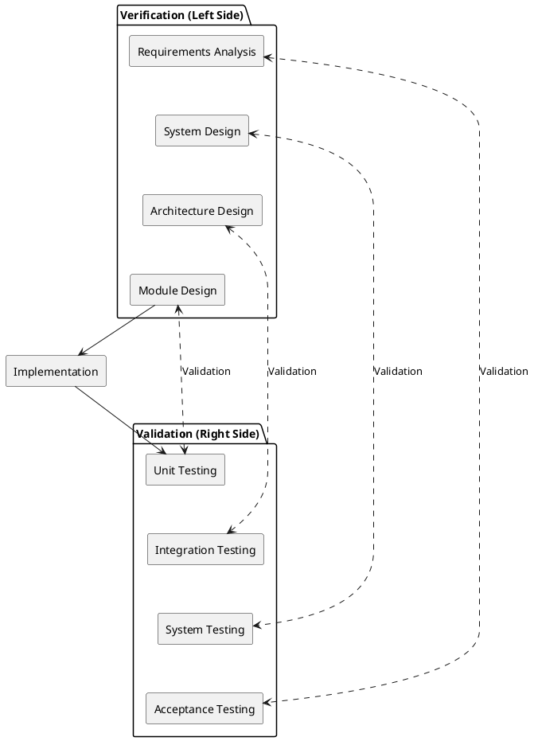

# Abstract  
This work focuses on the need for scalable and adaptable digital educational solutions by developing the Learnify system, a distributed software solution with the objective of ensuring seamless content delivery and user assessment. The primary goal is to make a durable multi-server solution that leverages the power of multiple programming languages for enhanced availability, data integrity, and optimized user response. This system was built with a polyglot microservices architecture, using programming languages such as Java and C# to ensure a strict interoperability implementation. Some of the key technical design choices are the use of gRPC for high-speed intra-service communication and HTTP for external client services, ensuring both speed and accessibility. Data storage is achieved using a PostgreSQL database, ensuring that security is taken into account using JWT authentication to overcome the potential dangers of distributed systems. This application development occurred using an iterative approach, centering around User Stories developed both using specialized analysis and interviews with the stakeholders. A functional prototype that can manage multiple user sessions concurrently in a distributed manner was developed. This prototype was verified to meet essential non-functional requirements, confirming the successful interoperability of components across Java and C#. Security compliance was established through the validation of salted password hashing algorithms using Argon2, ensuring robust data protection alongside reliable persistence in the PostgreSQL database. Moreover, the interface was validated for conformance with recognized accessibility guidelines to support complete usability by those with color vision defects. Finally, the project achieved a fully deployable distributed system, validating that the architecture provides a secure, stable, and operational foundation for scalability in the future of education. 

---

# Introduction  
Acquiring new knowledge is essential part of human life and evolution. Living in the population equals communicating within it and that requires some minimum level of knowledge.(REFERENCE) The idea of mandatory education keeps its origin between late 1900s and early 2000s(REFERENCE), nonetheless around 40% of the global population still does not have access to proper education in a language they understand (PTI, 2025).

The aim of this project is on the ability to create a system which would be able to provide learning opportunities with main focus on simplifying the accessibility and exploring the idea of learning processes and its speed and efficiency. The goal is to also ensure security, knowledge correctness and deployment of the system.

With the pursuit of knowledge having been a cornerstone of human development for thousands of years, the incorporation of digital technologies into education is in perpetual evolution (Siemens, 2005). A widely accepted model for learning with digital technologies has not been identified, mainly because exponential increases in computing power and volumes of online information constantly redefine how users approach knowledge acquisition, processing, and retention (Haleem et al., 2022).

The approach of this project is to develop a distributed system implemented using at least 2 different programming languages, utilizing a database for data persistence, and adapting a hybrid communication strategy that includes technologies such as gRPC and HTTP.

---

# Main Section  
In the main section development experience of the "Learnify" e-learning platform is being documented. It describes the importance of essential phases that took place in the development process from the vision to a working software system. This chapter is organized around the core stages: Analysis, Design, Implementation, and Testing, ensuring that each were necessary while building the system.

This chapter starts by elaborating Analysis phase, which incorporates the functional and non-functional requirements, use case diagrams, use case descriptions activity diagrams, threat model as well as the domain model of the system. The design section then focused on forming each parts of the system's architectures and database design, including the communication methods such as gRPC and HTTP. The Implementation stage converted the blueprints into components in two programming languages - C# and Java - that exhibit the integrated logic of the system. Finally, Testing were performed to ensure the system behaves according to the requirements and also meets the general objectives of the project.

## Analysis

In the beginning of the technical documentation Analysis processes of the the distributed system - "Learnify" - are described. This stage applies the higher-level goals of the project to the real challenges that come with the multi-language distributed system.

For defining the scope of the proposed system with clarity, the initial idea was thoroughly refined using requirements. This involved the identification and definition of the functional requirements of the system as well as non-functional ones, including latency, scalability, and security, which are the most important requirements of the distributed learning system.
In addition, several interviews with potential clients were done in order to gather new data which helped creating and updating the requirements and then use cases.
This stage of analysis also involved the use of structured modeling. The Use Case and Activity Diagrams were used for the representation of user interaction and system behavior, and the Domain Model defined the conceptual framework for the design of data persistence and service integration.

### Requirements
#### Functional requirements
1. As a User, I want to register for an account so that I can access the platform.
2. As a User, I want to log in so that I can access the platform from my account.
3. As a User, I want to view "My Courses" dashboard, so that I can see all the courses I am currently enrolled in.
4. As a User, I want to resume my active course from where I left off, so that I can continue learning from where i left.
5. As a User, I want to browse the "All Courses" catalog, so that I can discover new subjects to learn.
6. As a User, I want to filter courses by category or search query, so that I can find specific content quickly.
7. As a User, I want to unenroll from a course, so that I can remove content I am no longer interested in from my dashboard.
8. As a User, I want to view the Leaderboard, so that I can compare my progress with other learners.
9. As a User, I want to view my Profile, so that I can see my personal account details.
10. As a User, I want to complete Multiple Choice Questions in a learning step, so that I can test my knowledge.
11. As a User, I want to complete Fill-in-the-Blank exercises, so that I can practice recalling information.
12. As a Teacher, I want to create a new course draft, so that I can start building a new curriculum.
13. As a Teacher, I want to edit learning steps directly from the learning page, so that I can correct mistakes or improve content.
14. As an Admin, I want to view the Admin Panel, so that I can access administrative tools and settings.
15. As a Teacher, I want to edit course information, so that I can correct mistakes.
16. As an Admin, I want to view a list of waiting drafts, so that I can see which courses need approval.
17. As an Admin, I want to approve course drafts, so that they become available for students to enroll in.
18. As an Admin, I want to create new course categories, so that new types of courses can be introduced.
19. As an Admin, I want to add new languages, so that Teachers can create courses in other available languages.
20. As an Admin, I want to manage users’ roles, so that I decide who is a teacher and admin.
21. As an Admin, I want to disapprove course drafts, so that they become unavailable for students to enroll in. 

#### Non-functional requirements
1. The system must utilize at least two different programming languages
2. User passwords must be stored securely, using a strong, salted hashing algorithm before persistence
3. The system must use a robust database for all persistent data storage.
4. The system has to be deployable
5. The system has to be color blind people friendly

The requirements were taken from not only the initial vision of the system but also from interviews with real persons that could actually experience the system in the development stages and give relevant feedback to the team. The functional requirements were structured as "user stories" so that the team could maintain clear user perspective development, ensuring that every feature was directly tied to who is making what interaction with the system and how does the user is going to benefit from performing the action - why would he do it. This provided consistent framework for later analysis phases. 

### Use case diagram

The use case diagram visible on the Figure X below shows all use cases and their actors, which were made out of functional requirements. The goal of the project was to include security within the system by using authorization and authentication. Consequently, because of that all use cases require an authenticated user. In addition, two internal actors, Teacher and Administrator, were designed to inherit from Learner, while also having extra use cases which are not accessible for Learners.

### Use cases and their related requirements

The table on the Figure below shows the connections between use cases and the requirements they cover.

### Use case description

Complete Learning Activity Use Case Description shown on the figure presents that use case description were made with precision by focusing on different scenarios and alternate sequences while also sometimes covering more than one requirement.

### Activity diagram

The activity diagram below shows the workflow of the given "Complete Learning Activity" use case. The diagram highlights the sequence of operations performed by the user and the system, which begin with the display of a question or an exercise. Validation logic is highlighted in this activity diagram where the system analyzes the response of the user. Based on this, if a wrong solution is provided, a "feedback loop" is initiated where a message prompts the user to try again. As a result, a learning activity will be marked accomplished only when a correct answer is given, which demonstrates a mastery learning technique.

### Threat model
### Domain model

## Design

### System design
### Architectural overview
### Communication protocol design

*Interface Definition (IDL): Show snippets of your .proto files (if using gRPC).

API Specification: Briefly describe the HTTP endpoints (e.g., RESTful routes).

Protocol Choice: Explain why gRPC was used for internal communication vs. HTTP for external (or however you structured it).*
### Database design
### Class diagram design
### Communication Protocol Design:
### Data Persistence Design (maybe we should add some design related to this?):

ER Diagram: showing how data is structured in the database.

Consistency Model: Since it is distributed, mention how you handle data integrity across services.

## Implementation

Focus on the "Polyglot" aspect (using 2+ languages) and the "Activities" involved.

### Methods and tools

List the two languages (e.g., Go, Java, Python) and the database (e.g., PostgreSQL, MongoDB).

Justification: Explain why each language was chosen for its specific task. (e.g., "Go was selected for the backend service due to its concurrency handling...").

### Server A Implementation (Language 1):
### Server B Implementation (Language 2):
### Server C Implementation:
### Integration Logic:

Show how the two services "talk" to each other. Provide a code snippet showing the gRPC client/server handshake or the HTTP request handling.

## Testing
### Testing Approach

Testing in this project was structured around the V-Model, where testing activities are planned in parallel with developments phases. Instead of treating testings as a final step, test considerations were introduced early, starting at the requirement analyses, and refined as the system design evolved. This approach ensured that development decision had a corresponding verification strategy.

The first step of the V-Model was requirement analysis, which directly maps to acceptance testing.

At this stage, testing focused on answering a simple but critical question:

How can we tell that the system fulfills the user's requirements?

Rather then writing code-level tests, the team defined high-level acceptance criteria for each use case. These criteria described:

- What user expects to achieve
- Under which conditions the system should allow or deny actions
- What outcome confirms that the requirement is fulfilled

These acceptance-oriented test ideas were later used to validate the system both manually and through automated test. In this way, test cases were already embedded in the analysis phase, even before implementation began.

### Tools and frameworks
### What was tested
### Method-level test case documentation
### Benefits and bug detection

## Result

The guidelines require you to support results with data, programs, or models.

## Final Product Showcase: Screenshots of the "Learnify" app UI or console logs showing successful data processing.

## Ethical Considerations:

Requirement: You must describe ethical considerations and how negative impacts are minimized.

Content: Discuss data privacy (GDPR), user consent, or the societal impact of the app.

---

# Discussion  

---

# Conclusion and Recommendations  

---

# References  
- project description sep3  
- PTI. (2025, March 2). 40% global population doesn’t have access to education in language they understand: UNESCO. Deccan Herald. https://www.deccanherald.com/world/40-global-population-doesnt-have-access-to-education-in-language-they-understand-unesco-3428194
- https://static1.squarespace.com/static/6820668911e3e5617c36c48c/t/682dadc9690ec5749004d96d/1747824073835/connectivism.pdf
- https://www.sciencedirect.com/science/article/pii/S2666412722000137

--- 

# Test 123

