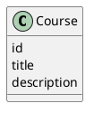

# Abstract

This work focuses on the need for scalable and adaptable digital educational solutions by developing the Learnify system, a distributed software solution with the objective of ensuring seamless content delivery and user assessment. The primary goal is to make a durable multi-server solution that leverages the power of multiple programming languages for enhanced availability, data integrity, and optimized user response. This system was built with a polyglot microservices architecture, using programming languages such as Java and C# to ensure a strict interoperability implementation. Some of the key technical design choices are the use of gRPC for high-speed intra-service communication and HTTP for external client services, ensuring both speed and accessibility. Data storage is achieved using a PostgreSQL database, ensuring that security is taken into account using JWT authentication to overcome the potential dangers of distributed systems. This application development occurred using an iterative approach, centering around User Stories developed both using specialized analysis and interviews with the stakeholders. A functional prototype that can manage multiple user sessions concurrently in a distributed manner was developed. This prototype was verified to meet essential non-functional requirements, confirming the successful interoperability of components across Java and C#. Security compliance was established through the validation of salted password hashing algorithms using Argon2, ensuring robust data protection alongside reliable persistence in the PostgreSQL database. Moreover, the interface was validated for conformance with recognized accessibility guidelines to support complete usability by those with color vision defects. Finally, the project achieved a fully deployable distributed system, validating that the architecture provides a secure, stable, and operational foundation for scalability in the future of education.

\newpage

# Introduction

Acquiring new knowledge is essential part of human life and evolution. Living in the population equals communicating within it and that requires some minimum level of knowledge (UNESCO, 2000). The idea of mandatory education keeps its origin between late 1900s and early 2000s(Habermas, 1984), nonetheless around 40% of the global population still does not have access to proper education in a language they understand (PTI, 2025).

The aim of this project is on the ability to create a system which would be able to provide learning opportunities with main focus on simplifying the accessibility and exploring the idea of learning processes and its speed and efficiency. The goal is to also ensure security, knowledge correctness and deployment of the system.

With the pursuit of knowledge having been a cornerstone of human development for thousands of years, the incorporation of digital technologies into education is in perpetual evolution (Siemens, 2005). A widely accepted model for learning with digital technologies has not been identified, mainly because exponential increases in computing power and volumes of online information constantly redefine how users approach knowledge acquisition, processing, and retention (Haleem et al., 2022).

The approach of this project is to develop a distributed system implemented using at least 2 different programming languages, utilizing a database for data persistence, and adapting a hybrid communication strategy that includes technologies such as gRPC and HTTP.

\newpage

# Main Section

The main section of this document is organized in the direction from the high-level analysis of the problem towards the specific implementation, testing and other relevant aspects of the solution created. This direction does not represent the chronological order of the project development and thus some aspects of the problem might not have a solution designed, implemented, tested, or deployed yet.

This overview represents merely a snapshot of the project development across each phase, and thus does not present a full solution or even analysis of the problem domain.

## Analysis

The fundamental domain knowledge was at first derived from the analyzed problem domain via literature review, and research. Because of the data-driven nature of this project, the analysis focused on stakeholder interactions since the beginning to ensure proper understanding and to test the assumptions made. With more progress made on the solution, the analysis was evolutionary refined to reflect the new understanding of the problem domain in the specificities of the solution space created by Learnify.

The most abstract and crucial aspect of the analysis was defining the system actors. The actors were defined to be:

- Learners
- Teachers
- Admins

The most questionable aspect of the definition was the relationship between the roles, and particularly how teachers and admins relate to it. It was established that teachers and admins are a type of a learner, and this was confirmed throughout the project most importantly because:

- both teachers and admins were expected to be skilled users of the platform (Appendix 10.1, Interview_261125.pdf) and were supposed to be educated on it (Appendix 10.1, TODO: Sasha update this)
- both teachers and admins were understood as learners within the leaderboard setting and were expected to be equal participants in it (Appendix 10.1, TODO: Sasha update this)

### Actor Descriptions

#### Learner

Learners strive for knowledge acquisition. They want to be motivated to learn and they should be allowed to have a structured way of learning new information. They want to be able to learn various different topics at their own pace. They are looking for a gamified experience.

#### Teacher

Teachers are trusted Learners, who also want to share their knowledge with others. They want to be able to manage courses easily and have a structured way of doing it.

#### Administrator (Admin)

Admins are trusted Learners, who have the right to manage the platform. They should be able to manage all learners, and platform settings.

### Requirements

#### Functional requirements

The functional requirements are structured as user stories to better capture the perspective of the actor and to clarify permissions and intentions behind each requirement. This way the user stories served as the fundamental source of truth and a guide light for understanding the problem and being able to design a solution that would address the problem preserving the idea behind the intention of the actor.

|  ID   | User Story                                                                                                                |
| :---: | :------------------------------------------------------------------------------------------------------------------------ |
| USL1  | As a Learner, I want to register for an account so that I can access the platform.                                        |
| USL2  | As a Learner, I want to log in so that I can access the platform from my account.                                         |
| USL3  | As a Learner, I want to see in which courses I am enrolled in, so that I can continue where I left off.                   |
| USL4  | As a Learner, I want to continue learning where I left off, so that I don't have to start over every time.                |
| USL5  | As a Learner, I want to see all available courses, so that I can explore and choose what I want to learn.                 |
| USL6  | As a Learner, I want to filter courses, so that I can find specific content quickly.                                      |
| USL7  | As a Learner, I want to unenroll from a course, so that I can stop learning a course I no longer want to finish.          |
| USL8  | As a Learner, I want to view the Leaderboard, so that I can compare my progress with other learners.                      |
| USL9  | As a Learner, I want to view my Profile, so that I can see my personal account details.                                   |
| USL10 | As a Learner, I want to test my knowledge within the course, so that I know I understood the topic and I am not bored.    |
| UST1  | As a Teacher, I want to submit a course draft, so that I can find out if my course idea is relevant for the platform.     |
| UST2  | As a Teacher, I want to manage course content, so that I can correct or improve previous work.                            |
| UST3  | As a Teacher, I want to edit course information, so that I can correct mistakes.                                          |
| USA1  | As an Admin, I want to see all drafts, so that I know what drafts are waiting for approval.                               |
| USA2  | As an Admin, I want to approve course drafts, so that the teacher knows they can work on such course.                     |
| USA3  | As an Admin, I want to add course categories and languages, so that the platform can easily adapt to new content.         |
| USA4  | As an Admin, I want to manage users’ roles, so that I can manage what access is given to the platform and to what degree. |
| USA5  | As an Admin, I want to disapprove course drafts, so that the teacher knows such course is not needed at the moment.       |

*Table 1: Functional Requirements (Appendix 2.1 Requirements)*

The user stories are sorted based on the actors to which they correspond, not according to the chronological order in which they were added/discovered. The chronological order is also not perfectly reflected on the IDs, as these were not always static for the same user story (when managing them, they would be adjusted)

#### Non-functional requirements

1. The system must be polyglot
2. User passwords must be securely stored at rest
3. The system must be deployable
4. The system must be color-blind friendly

### Use cases and their related requirements

In order to address the user stories, use cases of the system were developed, which further clarified the requirements and provided a basis for understanding the system behaviour (giving basis for dynamic rather than static analysis).

The uses cases developed are shown in a table below:

| ID   | Use Case                   |
| :--- | :------------------------- |
| UC1  | Register                   |
| UC2  | Log in                     |
| UC3  | Manage Personal Learning   |
| UC4  | Browse and Search Catalog  |
| UC5  | Complete Learning Activity |
| UC6  | View User Profile          |
| UC7  | View Leaderboard           |
| UC8  | Create Course Draft        |
| UC9  | Edit Course Content        |
| UC10 | Manage System Metadata     |
| UC11 | Review Course Drafts       |
| UC12 | Manage User Roles          |

*Table 2: Use Cases (Appendix 2.2 Use Cases)*


The table below shows how the use cases are related to the user stories

| User Story | Use Cases Addressing It |
| :--------- | :---------------------- |
| USL1       | UC1                     |
| USL2       | UC2                     |
| USL3       | UC3                     |
| USL4       | UC3, UC5                |
| USL5       | UC4                     |
| USL6       | UC4                     |
| USL7       | UC3                     |
| USL8       | UC7                     |
| USL9       | UC6                     |
| USL10      | UC5                     |
| UST1       | UC8                     |
| UST2       | UC9                     |
| UST3       | UC9                     |
| USA1       | UC11                    |
| USA2       | UC11                    |
| USA3       | UC10                    |
| USA4       | UC12                    |
| USA5       | UC11                    |

*Table 3: Use Cases and their related requirements (Appendix 2.2 Use Cases)*


### Use case diagram (UCD)

To depict how the use cases were related to the system actors, a use case diagram was created as shown below:


As can be seen, the UCD also introduced the internal boundary for teachers and admins - specifying that these actors are not simply learners with privileges but there is a boundary to be crossed when becoming a teacher or an admin. The UCD also specifies the system boundary, which in the case of Learnify covers all the use cases developed.

### Use case descriptions

In order to fully describe the use cases, use case descriptions were created; an example below shows such use case description, specifically for the UC5 - Complete Learning Activity use case:


As seen above, the use case descriptions provided a structured way of understanding how the system should behave and gave a strong basis for the test cases. 

All the use case descriptions were made in the same format with:

- Use Case ID and Name
- Summary
- Actor(s)
- Preconditions
- Postconditions
- Base Sequence
- Alternative Sequences

### Test Cases

| Test Case ID | Test Case Name | Description | Precondition | Steps | Expected Result |
|--------------|----------------|-------------|--------------|-------|-----------------|
| TC_UC_01 | Register User | Verify that a new user can register and that invalid registrations are rejected | User does not already have an account | 1. User initiates registration.<br>2. System requests account details.<br>3. User submits registration data.<br>4a. System validates input.<br>5a. System creates account.<br>6a. System confirms registration.<br>— OR —<br>4b. System detects invalid input or existing user.<br>5b. System displays error message.<br>6b. User corrects input and resubmits. | Valid input creates a new account and prompts login; invalid input or duplicate credentials result in an error and retry option. |
| TC_UC_02 | Log In | Verify that a registered user can log in and that invalid credentials are rejected | User has a registered account and is logged out | 1. User initiates login.<br>2. User enters credentials.<br>3a. System authenticates credentials.<br>4a. System creates secure session.<br>5a. System grants access.<br>— OR —<br>3b. System rejects credentials.<br>4b. System displays authentication error.<br>5b. User retries login. | Valid credentials grant access; invalid credentials keep the user unauthenticated with error feedback. |
| TC_UC_03 | Manage Personal Learning | Verify that a learner can resume or unenroll from courses | Learner is logged in | 1. Learner opens enrolled courses list.<br>2. System displays enrollments and progress.<br>3a. Learner selects course to continue.<br>4a. System restores last saved progress.<br>— OR —<br>3b. Learner selects unenroll option.<br>4b. System removes course.<br>5b. System updates enrollment view. | Course resumes at last progress point or is removed from the learner’s list. |
| TC_UC_04 | Browse and Search Catalog | Verify that users can browse and filter courses, including no-result scenarios | User is logged in | 1. User opens course catalog.<br>2. System displays all courses.<br>3. User applies search or filter.<br>4a. System finds matching courses.<br>5a. System displays filtered results.<br>— OR —<br>4b. System finds no matches.<br>5b. System displays no-results message. | Matching courses are shown when available; otherwise a clear no-results message is displayed. |
| TC_UC_05 | Complete Learning Activity | Verify correct and incorrect answer handling during learning activities | User is enrolled and viewing a learning unit | 1. System displays learning activity.<br>2. User submits response.<br>3a. System evaluates as correct.<br>4a. System gives positive feedback.<br>5a. User proceeds to next unit.<br>— OR —<br>3b. System evaluates as incorrect.<br>4b. System provides corrective feedback.<br>5b. User retries activity. | Correct answers allow progression; incorrect answers provide feedback and allow retry. |
| TC_UC_06 | View User Profile | Verify that a user can view their profile information | User is logged in | 1. User accesses account information.<br>2. System displays profile details. | User profile information is displayed correctly. |
| TC_UC_07 | View Leaderboard | Verify that users can view leaderboard rankings | User is logged in | 1. User opens leaderboard view.<br>2. System displays ranking based on performance. | Leaderboard rankings are displayed successfully. |
| TC_UC_08 | Create Course Draft | Verify that a teacher can create a new course draft | Teacher is logged in | 1. Teacher initiates course creation.<br>2. Teacher enters course metadata.<br>3. Teacher submits draft.<br>4. System saves draft. | Course draft is successfully created and stored. |
| TC_UC_09 | Edit Course Content | Verify that a teacher can edit and save course content | Teacher is logged in and course exists | 1. Teacher selects content unit.<br>2. Teacher enters edit mode.<br>3. Teacher modifies content.<br>4. Teacher saves changes.<br>5. System updates content. | Course content changes are saved successfully. |
| TC_UC_10 | Manage System Metadata | Verify that administrators can manage categories and languages | Administrator is logged in | 1. Admin opens metadata management.<br>2a. Admin manages categories.<br>3a. Admin creates new category.<br>4a. System saves category.<br>— OR —<br>2b. Admin manages languages.<br>3b. Admin creates new language.<br>4b. System saves language. | New categories or languages become available in the system. |
| TC_UC_11 | Review Course Drafts | Verify that administrators can approve or disapprove drafts | Administrator is logged in and drafts exist | 1. Admin opens pending drafts list.<br>2. System displays drafts.<br>3. Admin reviews draft.<br>4a. Admin approves draft.<br>5a. System publishes course.<br>— OR —<br>4b. Admin disapproves draft.<br>5b. System keeps course unavailable. | Approved drafts become visible to learners; disapproved drafts remain hidden. |
| TC_UC_12 | Manage User Roles | Verify that administrators can assign or remove user roles | Administrator is logged in | 1. Admin opens user management.<br>2. Admin selects user.<br>3a. Admin assigns new role.<br>4a. Admin saves changes.<br>5a. System updates permissions.<br>— OR —<br>3b. Admin removes existing role.<br>4b. System updates permissions. | User roles and permissions are updated correctly. |

*Table 4: Use Cases and their related requirements (Appendix 2.2 Use Cases)*

### Activity diagram

The activity diagram below shows the workflow of the given "Complete Learning Activity" use case. The diagram highlights the sequence of operations performed by the user and the system, which begin with the display of a question or an exercise. Validation logic is highlighted in this activity diagram where the system analyzes the response of the user. Based on this, if a wrong solution is provided, a "feedback loop" is initiated where a message prompts the user to try again. As a result, a learning activity will be marked accomplished only when a correct answer is given, which demonstrates a mastery learning technique.


### Domain model

The domain model was constructed for this project to better understand the problem domain and to aid communication among stakeholders. The crucial aspect of developing the domain model was identifying the relationships between different kinds of users, in particular the roles and responsibilities of Learners, Teachers, and Administrators; which had to be combined with the security aspect of the system as well as had to align with the shared understanding of the stakeholders.


The figure above shows the domain model for Learnify. It can be seen that the crucial aspect of fully describing the different system roles is understanding what entities exist and how they relate to each other.

The inheritance from the User entity reflects the fact that all system users have some common basic attributes, rights and behaviours that can be generalized.

The philosophy behind the attribute selection and abstraction into separate entities was to provide full flexibility for future development of the system, and ensuring that no restrictions are imposed for no reason. For example, Learning Steps are abstracted into three different entities to fully support any kind of idea of a learning step as seen both in the domain and from stakeholder interactions.

At the same time, the domain model was kept in its simplest form possible in terms of more abstract entity concepts. As can be seen on the domain model, the core aspects of the system are:

- Users
- Courses
- Learning Steps

And it could be further argued that Learning Steps only exist as a part of Courses, therefore the Domain Model is centered around the idea of Users learning from Courses, which did not change from the initial vision of the system.

### Security Requirements

The security requirements for the system were developed as a part of the threat modelling process. The security objectives were as follows:

- **Confidentiality:** Protect user passwords and personal data from unauthorized disclosure.
- **Integrity:** Ensuring that data can not be altered or tampered with by unauthorized parties.
- **Availability:** Ensure the system remains accessible during high traffic or denial-of-service attempts.
- **Accountability:** Actions must be uniquely traceable to a specific entity.
- **Authenticity:** Verify that data inputs and users are genuine.

These objectives were developed based on the CIA triad and expanded to fit the needs of the system (Appendix A: Threat Model).

Similarly to other parts of the analysis phase, stakeholder interactions shaped the system's security requirements. In particular, even testing the prototype (before having the core system functional) showed concerns about the authority of Administrators and Teachers, and needs for accountability for actions.

## Design

### System design

#### Wireframes
*Figure X: All Courses Page Wireframe*


The creation of the fronted included the designing wireframes of the web pages. One of the them is visible on the diagram above - All Courses Page Wireframe (Appendix A: Wireframes-2.png). This wireframe design shows a user-centered approach which enables simple course catalog browsing which is accessible for all users. The system provides users with two extra features which consist of a search function and category-based filtering options at the top of the interface. The content organization uses card-based design which shows key details including title, description, category and language of the course to assist users with their enrollment decisions. The interface includes also features which are showed only to users with specific roles (Teacher, Admin). It can be seen that there are two action buttons named "Create Draft" which appears only for users with a Teacher role and "Waiting Drafts" which appears only for users who are an Administrator. These buttons give Teachers and Administrators quick access to content creation and moderation tool while keeping the learner view free from unnecessary elements.

### Architectural overview

The architectural overview shown on the picture below presents how the three-tier architecture of the system was looks like including all servers and how they communicate between them. Starting with client layer, which is responsible for running a server in C# Blazor .NET, it can be seen that its job is to host a web application which can be accessible by three types of users (Learners, Teachers and Administrators). Client application communicates with Logic Server, located inside the logic layer, by using HTTP requests and responses. Then from the Logic server information is being sent further into the data server, located inside data tier, which happens by following the gRPC protocol, which is faster than HTTP due to different formatting. Logic server was implemented using C# and Data server using Java. At the end of the architecture chain we have the Postgres database. The data is received through sockets.
Although the three-tier overview seems to appear a bit basic, each tier plays their own important role in the system, ensuring that for example data server is not responsible for any feature logic but only performs operations between the database.


### Communication protocol design

The system implements a multi-tiered architecture that utilizes distinct communication protocols for external and internal interactions. The sequence diagram in Figure X illustrates the end-to-end communication flow, demonstrating how the Client, Logic Server, and Data Server interact to process a request.


#### Interface Definition (gRPC & Protobuf)

Internal communication between the Logic Server and the Data Server is managed via gRPC. The data structures and service contracts are defined using Protocol Buffers (Protobuf), ensuring strict typing.

Figure X demonstrates the definition of the message structures (Requests and Responses) used within the system.


Figure X illustrates the service definition, detailing the available RPC methods, their required parameters, and return types.return.


#### API Specification

The Logic Server exposes a RESTful API to external clients using standard HTTP/1.1 protocols. This design streamlines client integration by using standard HTTP verbs (GET, POST, PUT, DELETE) and status codes.

For example, authentication is handled via the /auth/login endpoint. By sending a POST request to http://localhost:9090/auth/login with the correct credentials, a client can successfully authenticate and connect to the system.

#### Protocol Justification

A hybrid protocol approach was chosen to balance user experience with system performance:

· External Communication (HTTP/JSON): We utilized HTTP with JSON for client-server interaction because of its universality and readability. JSON is natively supported by web browsers and mobile clients, making the system easy to debug and integrate. While the text-based format introduces some overhead, the trade-off favors the ease of development and broad compatibility required at the client layer.

· Internal Communication (gRPC/Protobuf): For communication between the Logic and Data servers, gRPC was selected over REST. Unlike the text-based JSON, gRPC uses Protocol Buffers to serialize data into a binary format. This results in significantly smaller payload sizes and faster serialization/deserialization times. Furthermore, gRPC operates over HTTP/2, allowing for multiplexing and lower latency, which is critical for high-throughput internal traffic.

### Database design

#### Enhanced Entity Relationship Diagram

As means of bridging the gap from the problem domain in general and the Learnify system in specific, an EER diagram was created as can be seen on the figure below:


The EER developed does not significantly differ from the domain model as both diagrams are conceptual and could in theory be used interchangeably. However, the EER diagram further reflects the decisions made during analysis, which most notably reflected on the way how roles are handled.

```plantuml {max-width=50% max-height=50% caption="SystemUser to Role Relationship"}
@startuml
class SystemUser {
    id
}
class Role {
    role
}
SystemUser "*" -right- "*" Role : has
@enduml
```

The figure above focuses on the relationship between the User and their Roles. This relationship in contrast to inheritance based models provides a flexible and strict way of handling user roles - their permissions and access to the system. Most importantly it does not hide the complexities of inheritance into a seemingly simple abstraction and prevents the potential issues that could arise from mindless inheritance hierarchies.

#### Relational Schema

Contrary to the conceptual modelling, the logical modelling required adherence to the rules and specificities of the relational model.
Because of the designed use of standard relational database (PostgreSQL), the mapping of the EER needed to determine all the necessary resolutions of relationships, strong and weak entities, and the establishment of integrity keys.

The mapping of the EER diagram resulted in a relational schema and the to it related global relations diagram.

The mapping resulted in the relation schema as shown on the figure below:


As can be seen, the many-to-many relationships got resolved into new relations - SystemUserRole, and UserCourseProgress.

```plantuml {max-width=50% max-height=50% caption="SystemUser to Role Relationship Resolution"}
@startuml
class SystemUser {
    id
}
class Role {
    role
}
class SystemUserRole {
    systemUserId
    roleId
}
SystemUser "1" -right- "*" SystemUserRole
Role "1" -left- "*" SystemUserRole
@enduml
```

#### Global Relations Diagram (GR/GRD)

Relational schema and Global Relations Diagram are technically identical. In the project Learnify, the GRD was the main source of truth for later implementation of the database structure and discussing the data persistence design.

The final GR diagram is shown on the figure below:


It can be seen that the GRD reflects the same concepts as the relational schema, however, in this case the positioning of the elements provides a more natural step going from the EER and the domain model; although, the positioning did not fully preserve the conceptual relationships as seen in the EER diagram.

### Class diagram design

### Communication Protocol Design:

### Data Persistence Design (maybe we should add some design related to this?):

ER Diagram: showing how data is structured in the database.

Consistency Model: Since it is distributed, mention how you handle data integrity across services.

## Implementation

The implementation of the system followed the designed architecture and communication protocols with a focus on setting up the core of the architecture first as one continuous vertical slice.

At first, a database schema was created in PostgreSQL, a Springboot project was created for the Data Server, and two .NET solutions were created for the Logic Server and the Client Application.

This stage did not include any actual logic but rather provided a skeleton of the system. One of the decisions taken at this stage was to maintain separate solutions for the Logic Server and Client Application. Despite the initial idea of implementing a shared solution, it was decided that the feature of C# anonymous types would suffice for most of the purposes of data transfer objects (DTOs) and that the added complexity of a shared solution would not be justified.

The implementation of the skeleton was followed by a the implementation of a vertical slice which focused on fetching all courses from the database.

The individual components of the vertical slice can be seen below:



At a later stage, the original database setup was split into pure DDL script and a dummy data initial setup crucial for testing stages mentioned later in this document.

### Methods and tools

List the two languages (e.g., Go, Java, Python) and the database (e.g., PostgreSQL, MongoDB).

Justification: Explain why each language was chosen for its specific task. (e.g., "Go was selected for the backend service due to its concurrency handling...").

### Server A Implementation (Language 1):

### Server B Implementation (Language 2):

### Server C Implementation:

### Integration Logic:

Show how the two services "talk" to each other. Provide a code snippet showing the gRPC client/server handshake or the HTTP request handling.

## Testing

### Testing Approach

Testing in this project was structured around the V-Model, where testing activities are planned in parallel with developments phases. Instead of treating testings as a final step, test considerations were introduced early, starting at the requirement analyses, and refined as the system design evolved. This approach ensured that development decision had a corresponding verification strategy.

The first step of the V-Model was requirement analysis, which directly maps to acceptance testing.

At this stage, testing focused on answering a simple but critical question:

How can we tell that the system fulfills the user's requirements?

Rather then writing code-level tests, the team defined high-level acceptance criteria for each use case. These criteria described:

- What user expects to achieve
- Under which conditions the system should allow or deny actions
- What outcome confirms that the requirement is fulfilled

These acceptance-oriented test ideas were later used to validate the system both manually and through automated test. In this way, test cases were already embedded in the analysis phase.

In practice, different types of tests naturally aligned with different parts of the V-Model:

- High-level test cases and use-case validation corresponded to the upper part of the V (requirements and acceptance testing).
- Automated tests focused mainly on the lower part of the V, especially unit and integration testing.

Automated tests focused mainly on the lower part of the V, especially unit and integration testing.

### Tools and frameworks

A combination of automated and manual testing tools was used throughout the project:

- xUnit / JUnit – Used for writing automated unit and integration tests.
- Mockito / Mocking frameworks – Used to isolate logic and mock external dependencies.
- HTTP client–based tests – Used for endpoint-level testing.
- .http files – Used early in development for manual REST endpoint testing.
- BloomRPC – Used for manually testing gRPC endpoints.
- In-memory repositories – Used to test logic without external dependencies.
- IDE tooling (Visual Studio / IntelliJ) – Used for writing, executing, and debugging tests.

### What was tested

Testing focused primarily on core logic and system-critical behavior, rather than attempting full coverage of all UI components.

The following aspects of the system were tested:

- Business logic in the logic server
- REST and gRPC endpoints
- Authentication and authorization behavior
- Role-based access control
- Course and draft management workflows
- Integration between services

The team aimed for high endpoint coverage, testing endpoints under different scenarios such as:

- Different user roles and credentials
- Authorized vs. unauthorized access
- Expected success paths

However, testing of faulty or malformed input data was less comprehensive. While access control and permissions were thoroughly tested, negative scenarios involving invalid data were sometimes under-tested. This limitation is acknowledged as an area for improvement.

### Method-level test case documentation

Method-level testing focused on logic-heavy and high-impact methods, following a white-box testing approach. Instead of testing every method, priority was given to areas where errors would have the greatest impact on system behavior.

For critical methods, tests were designed to cover:

- Normal execution paths
- Boundary conditions
- Exceptional cases
- Interface correctness

This approach ensured that the internal behavior of key methods was thoroughly validated, not just their external outputs. Test cases were documented to show clear intent and traceability between requirements, logic, and expected outcomes.

| Test Case ID | Test Case Name | Description | Precondition | Steps | Expected Result | Actual Result |
|--------------|----------------|-------------|--------------|-------|-----------------|---------------|
| TC_UC_01 | Register User | Verify that a new user can register and that invalid registrations are rejected | User does not already have an account | 1. User initiates registration.<br>2. System requests account details.<br>3. User submits registration data.<br>4a. System validates input.<br>5a. System creates account.<br>6a. System confirms registration.<br>— OR —<br>4b. System detects invalid input or existing user.<br>5b. System displays error message.<br>6b. User corrects input and resubmits. | Valid input creates a new account; invalid input results in error and retry option. | New accounts were successfully created with valid input. Invalid or duplicate data correctly triggered error messages and prevented registration. |
| TC_UC_02 | Log In | Verify that a registered user can log in and that invalid credentials are rejected | User has a registered account and is logged out | 1. User initiates login.<br>2. User enters credentials.<br>3a. System authenticates credentials.<br>4a. System creates secure session.<br>5a. System grants access.<br>— OR —<br>3b. System rejects credentials.<br>4b. System displays authentication error.<br>5b. User retries login. | User gains access or receives authentication error. | Users with valid credentials were authenticated and granted access. Invalid credentials were rejected with clear error messages. |
| TC_UC_03 | Manage Personal Learning | Verify that a learner can resume or unenroll from courses | Learner is logged in | 1. Learner opens enrolled courses list.<br>2. System displays enrollments and progress.<br>3a. Learner selects course to continue.<br>4a. System restores last saved progress.<br>— OR —<br>3b. Learner selects unenroll option.<br>4b. System removes course.<br>5b. System updates enrollment view. | Course resumes or is removed from learner’s list. | Courses resumed at the last saved progress point. Unenrolled courses were removed immediately from the learner’s course list. |
| TC_UC_04 | Browse and Search Catalog | Verify that users can browse and filter courses, including no-result scenarios | User is logged in | 1. User opens course catalog.<br>2. System displays all courses.<br>3. User applies search or filter.<br>4a. System finds matching courses.<br>5a. System displays filtered results.<br>— OR —<br>4b. System finds no matches.<br>5b. System displays no-results message. | Course list updates or shows no-results message. | Matching courses were correctly filtered and displayed. When no matches existed, the system clearly indicated that no results were found. |
| TC_UC_05 | Complete Learning Activity | Verify correct and incorrect answer handling during learning activities | User is enrolled and viewing a learning unit | 1. System displays learning activity.<br>2. User submits response.<br>3a. System evaluates as correct.<br>4a. System gives positive feedback.<br>5a. User proceeds to next unit.<br>— OR —<br>3b. System evaluates as incorrect.<br>4b. System provides corrective feedback.<br>5b. User retries activity. | Correct answers progress; incorrect answers give feedback and retry. | Correct answers allowed progression to the next unit. Incorrect answers triggered corrective feedback and allowed repeated attempts. |
| TC_UC_06 | View User Profile | Verify that a user can view their profile information | User is logged in | 1. User accesses account information.<br>2. System displays profile details. | Profile information is displayed. | User profile details were displayed correctly and matched stored account information. |
| TC_UC_07 | View Leaderboard | Verify that users can view leaderboard rankings | User is logged in | 1. User opens leaderboard view.<br>2. System displays ranking based on performance. | Leaderboard is displayed. | The leaderboard displayed user rankings based on performance metrics without errors. |
| TC_UC_08 | Create Course Draft | Verify that a teacher can create a new course draft | Teacher is logged in | 1. Teacher initiates course creation.<br>2. Teacher enters course metadata.<br>3. Teacher submits draft.<br>4. System saves draft. | Course draft is created. | Course drafts were successfully saved and became visible in the administrator’s review list. |
| TC_UC_09 | Edit Course Content | Verify that a teacher can edit and save course content | Teacher is logged in and course exists | 1. Teacher selects content unit.<br>2. Teacher edits content.<br>3. Teacher saves changes.<br>4. System updates content. | Content changes are saved. | Edited course content was saved correctly and reflected immediately when reopened. |
| TC_UC_10 | Manage System Metadata | Verify that administrators can manage categories and languages | Administrator is logged in | 1. Admin opens metadata management.<br>2. Admin creates category or language.<br>3. System saves metadata. | Metadata becomes available. | Newly created categories and languages became available for course creation and filtering. |
| TC_UC_11 | Review Course Drafts | Verify that administrators can approve or disapprove drafts | Administrator is logged in and drafts exist | 1. Admin reviews pending draft.<br>2a. Admin approves draft.<br>3a. System publishes course.<br>— OR —<br>2b. Admin disapproves draft.<br>3b. System hides course. | Draft is approved or remains unavailable. | Approved drafts became visible in the course catalog. Disapproved drafts remained unavailable to learners. |
| TC_UC_12 | Manage User Roles | Verify that administrators can assign or remove user roles | Administrator is logged in | 1. Admin selects user.<br>2a. Admin assigns role.<br>3a. System updates permissions.<br>— OR —<br>2b. Admin removes role.<br>3b. System updates permissions. | User roles are updated. | User roles were updated correctly, and permissions changed immediately according to the assigned roles. |


### Benefits and bug detection

Testing played an important role in maintaining system stability throughout development and gave the team confidence when introducing changes.

One of the main benefits of automated testing was that it enabled safe refactoring. Because core logic and most endpoints were covered by tests, the team could restructure and improve the codebase without the constant risk of breaking existing functionality. This was especially valuable in later stages of the project, where refactoring became more frequent as the system matured.

In several cases, features appeared to work correctly when tested manually through the user interface, but automated tests revealed issues that were not immediately visible. These included:

- Missing validation for null or unexpected input
- Edge cases and boundary values not being handled correctly
- Operations failing silently without clear feedback

The team followed a continuous test–fix–verify cycle during development. When a problem was discovered, it was corrected, committed through version control, and often accompanied by additional tests to prevent similar issues in the future. Although the project did not strictly follow Test-Driven Development from the start, the gradual shift toward automated testing significantly improved reliability, reduced regressions, and supported ongoing changes as the project evolved.

## Result

The guidelines require you to support results with data, programs, or models.

## Final Product Showcase: Screenshots of the "Learnify" app UI or console logs showing successful data processing.

## Ethical Considerations:

Requirement: You must describe ethical considerations and how negative impacts are minimized.

Content: Discuss data privacy (GDPR), user consent, or the societal impact of the app.

---

# Discussion

#### What Has Been Accomplished

The main purpose of this project has been achieved through the creation of the “Learnify” distributed heterogeneous e-learning system which targets the problem of educational inequality. The system operates through a three-tier architecture which combines a C# Blazor client application with a Logic Server built in C# .NET and a Data Server developed in Java. The PostgreSQL database functions as the storage system which maintains all relevant information for every service. The system architecture uses gRPC protocol to establish fast communication between services while it employs HTTP protocol to enable client application interaction. The system has achieved full integration of 21 specific user stories which support the complete learning process. The system enables users to create new accounts through its registration feature. Users can browse course catalogs. Users can take part in courses. The system provides users with suitable interactive learning activities that deliver instant feedback. The system enforces a rigid role-based structure which applies to all users including Learners and Teachers and Administrators. The role hierarchy establishes a governance process which requires Teachers to obtain administrator approval before their content can be published. The security implementation utilizes industrial standards with Argon2 for Password Hashing with salting and JWT for Stateless Authentication. In addition, the User Experience has been strengthened with the incorporation of leaderboards for gamification and a Color Validated User Interface for color-deficient users. The overall requirements have been designed in accordance with the primary values laid down in the project and potential customers' feedback.

#### What Can Be Improved

Even with the successful implementation of the fundamental system, there are some aspects that need optimization towards the reduction of the identified security risks and the improvement of scalability. The basic application needs additional security measures to protect against advanced attacks even though it uses Argon2 password hashing and JSON Web Tokens. The Critical risk of unpatched software vulnerability exploitation requires automated scanning and effective patch management for future developments. The protection of high-risk systems against Man-in-the-Middle attacks and credential exploitation needs Transport Layer Security/Secure Sockets Layer combined with HTTP Strict Transport Security and Content Security Policies to prevent Cross-Site Scripting attacks and Multi-Factor Authentication. The system has passed normal functional tests to meet operational requirements but its performance under severe stress remains untested through extreme load testing. The risk assessment shows that Distributed Denial of Service requires future research to simulate high user volumes for identifying system bottlenecks.
Concerning user experience, there is still a lot of room for improving the inclusivity of the platform. Although the support for color vision disabilities is a good starting point, the support needs to be extended to implement full compatibility with the Web Content Accessibility Guidelines and screen readers for users with motor disabilities. In addition to this, the format of the learning model needs to change from the linear pattern that it currently supports to an adaptive path and also an advanced gamification system incorporating features like badges and streaks. Lastly, to avoid administrative delays that could arise in the future due to the expansion of users, it is advised that the manual content reviewing system should be integrated with an AI-powered content review system.

---

# Conclusion and Recommendations

The main goal of this study was to develop a scalable heterogeneous distributed e-learning system which tackles educational inequalities through superior performance and system integrity, while delivering an excellent user experience. The system development process required a three-tier architectural design which implemented a multi programming language approach by combining C#, Java, and the PostgreSQL database. The tests showed that the system operates effectively when handling multiple sessions and processing data.

The system delivered its core objectives but failed to achieve complete functionality because content moderation features remained unimplemented within the project timeframe. The system establishes a core structure which enables the creation of a distributed system.

Future research should direct its attention toward creating strong security systems which include Multi-Factor Authentication and advanced permission frameworks because the existing basic systems would need to evolve for commercial deployment. The learning platform will become better after the implementation of full accessibility features which include screen reader support and adaptive layout functionality. The platform requires testing for production-level usability and maximum load capacity to achieve production readiness and acceptable latency levels.

The project achieved success through its development of a distributed learning system which met all essential criteria established during the planning phases. However, there are still some areas which needs space for an improvement. The results of this study could possibly help educational institutions improve their technology systems which currently exist in schools. Digital learning systems produce various results which need to be evaluated during the evaluation process. The development team needs to resolve privacy issues and content recommendation problems and digital divide problems for future Learnify learning platform versions.

---

# References

- Haleem, A., Javaid, M., Qadri, M. A., & Suman, R. (2022). Understanding the role of digital technologies in education: A review. Sustainable Operations and Computers, 3(1), 275–285. https://doi.org/10.1016/j.susoc.2022.05.004
- Project Description.
- PTI. (2025, March 2). 40% global population doesn’t have access to education in language they understand: UNESCO. Deccan Herald. https://www.deccanherald.com/world/40-global-population-doesnt-have-access-to-education-in-language-they-understand-unesco-3428194
- Samonas, S., & Coss, D. (2014). The Cia Strikes Back: Redefining Confidentiality, Integrity and Availability in Security. In Journal of Information System Security (Vol. 10, Issue 3). https://www.proso.com/dl/Samonas.pdf
- Siemens, G. (n.d.). Connectivism: A Learning Theory for the Digital Age. https://static1.squarespace.com/static/6820668911e3e5617c36c48c/t/682dadc9690ec5749004d96d/1747824073835/connectivism.pdf
- Habermas, J. (1984). The theory of communicative action: Vol. 1. Reason and the rationalization of society (T. McCarthy, Trans.). https://teddykw2.wordpress.com/wp-content/uploads/2012/07/jurgen-habermas-theory-of-communicative-action-volume-1.pdf
- UNESCO. (2000). The Dakar framework for action: Education for all: Meeting our collective commitments. UNESCO Digital Library. https://unesdoc.unesco.org/ark:/48223/pf0000121147

# Appendices

## Appendix 2.1 Requirements

Can be found as TODO:eduard.pdf

## Appendix 2.2 Use Cases

### Use Case Diagram

Can be found as TODO:eduard.pdf

### Complete Learning Activity Use Case Description

Can be found as TODO:eduard.pdf

## Appendix 7.1 Threat Model

Can be found as ThreatModel.pdf

## Appendix 10.1: Stakeholder Interviews

### Interview David

Can be found as Interview_261125_1.pdf

### Interview Andrej TODO: Sasha update this

Can be found as Interview_XXX.pdf
